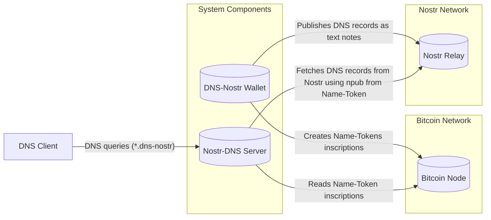

# Name-Tokens and DNS over Nostr

## Overview

This project introduces **Name-Tokens**, a novel and general protocol for
managing unique names and associating them with arbitrary data on the Bitcoin
blockchain. This protocol utilizes Bitcoin's inscription capabilities to embed
metadata within unspent transaction outputs (UTXOs), where each UTXO represents
a unique named token. The ownership and history of these named tokens are
immutably recorded on the blockchain.

Currently, this project focuses on a specific application of the Name-Tokens
protocol: **DNS over Nostr**. This system leverages named tokens to resolve
domain names within the `.dns-nostr` namespace using the decentralized Nostr
network. In this application, a `*.dns-nostr` domain name is represented as a
unique Bitcoin token. The inscription within this token's UTXO contains metadata
linking the domain name to a Nostr public key. This public key is then used by
the **DNS-Nostr Server** to fetch DNS records from Nostr relays.

The system consists of two main components: the **DNS-Nostr Wallet**
(specifically designed to create and manage `*.dns-nostr` named tokens) and the
**DNS-Nostr Server** for resolving domains within the **`.dns-nostr`**
namespace.

The **DNS-Nostr Wallet** allows users to create new `*.dns-nostr` tokens
(inscriptions), update the **DNS records associated with the token on the Nostr
network**, transfer token ownership, and potentially revoke tokens. It also
handles basic Bitcoin functionalities.

The **DNS-Nostr Server** resolves `*.dns-nostr` domain names by querying the
Bitcoin blockchain for the corresponding named token. Once found, it retrieves
the associated Nostr public key from the inscription and uses it to fetch DNS
records from the Nostr network.


## Features

### DNS-Nostr Wallet

- **Standard Bitcoin Wallet Functions**: Send and receive satoshis.
- **DNS-Nostr Name-Token** creation and management:
  - Create `*.dns-nostr` name-tokens on the Bitcoin blockchain.
  - Update the Nostr public key associated with a `*.dns-nostr` token (effectively changing where DNS records are fetched by the server), which requires creating a new inscription.
  - Transfer ownership of `*.dns-nostr` tokens to other wallets.
  - Revoke `*.dns-nostr` tokens.
- **Nostr Integration**: Publishes DNS configuration file content as text notes to a Nostr relay using the associated Nostr public key. This allows the DNS-Nostr server to fetch records from the Nostr network.

### DNS-Nostr Server

- **Name-Token Resolution:** Reads Bitcoin UTXOs by scanning the Bitcoin blockchain to find the mapping between `*.dns-nostr` domain names and their associated Nostr public keys.
- **Dedicated `.dns-nostr` Resolution:** Specifically resolves domain names ending with `.dns-nostr` by fetching DNS records from the designated Nostr relay using the associated Nostr public key.
- **Support for Standard DNS Records:** Plans to support common DNS record types (A, AAAA, CNAME, NS, MX, TXT) for `.dns-nostr` domains.

## Architecture



## Name-Token Specification

### Principles

These principles govern the creation, management, and validity of named tokens within the "Name-Token" system:

1. **Names as Unique Tokens:** Each unique name is represented by a single, distinct Unspent Transaction Output (UTXO) on the Bitcoin blockchain. This UTXO _is_ the _Name-Token_.
2. **Inscribed Metadata:** All relevant metadata for a Name-Token, including the name itself and an associated data, are permanently embedded within the UTXO's scriptPubKey using Bitcoin's inscription capabilities.
3. **UTXO Set as Chain State:** The current set of valid named tokens can always be determined by examining the active UTXO set of the Bitcoin blockchain. Only UTXOs conforming to the defined inscription format are considered valid Name-Tokens.
4. **Global Name Uniqueness:** For any given name, only one valid Name-Token can exist within the UTXO set at any time. This ensures that each name has a single, authoritative owner and associated data.
5. **First Confirmed Rule:** When a new name is inscribed for the first time, the earliest confirmed transaction creating such a token will be considered the valid registration. Subsequent attempts to inscribe the same name in new UTXOs will be disregarded unless they follow the update process or if the UTXO of the initially valid token is subsequently revoked. In such a case, the next earliest confirmed, non-revoked inscription for that name would become the valid token.
6. **Update via Spending and Reinscription:** To update the data associated with a named token, a new Bitcoin transaction must be created that spends the UTXO of the current inscription. This transaction must also include an output containing a new inscription with the same name and the updated associated data, effectively overriding the previous association.
7. **Positional Update Correlation:** A single Bitcoin transaction can update multiple named tokens. To achieve this, the **Nth** output containing the new inscription for a specific token must correspond to the **Nth** input that spends the UTXO of that token's previous inscription. Careful transaction construction is required to ensure this positional relationship is maintained for each updated token.
8. **Revocation as spending:** To revoke a named token, the owner must create a new transaction that spends the UTXO of the current inscription. This transaction should not include a new inscription for the same name, effectively invalidating the previous association and marking it as revoked.

### Inscription Format

The metadata for each Name-Token is embedded within the _scriptPubKey_ of one of
the outputs of the Bitcoin transaction that creates or updates the token. This
is typically achieved using an `OP_RETURN` output or a similar mechanism that
allows for embedding arbitrary data in a way that doesn't interfere with
standard Bitcoin transaction processing but can be identified by compliant
software.

The inscription follows a structured format using `OP_FALSE OP_IF ... OP_ENDIF`
to conditionally execute the data pushes, making it easily identifiable.

The general structure of the Name-Token inscription is as follows:

```bash
OP_FALSE
OP_IF
  OP_PUSH "name"            # Namespace identifier (ASCII string)
  OP_PUSH $label            # The unique name of the token (ASCII string)
  OP_PUSH $operation        # Type of operation: 0 for creation, 1 for update (single byte integer)
  OP_0                      # Section separator (OP_0 opcode)
  OP_PUSH $section_protocol # Identifier for the protocol using this token's data (ASCII string, e.g., "dns-nostr")
  OP_PUSH $argument_0       # Protocol-specific argument (format depends on <section_protocol>)
  # ...
  # Additional protocol-specific sections can be added, each preceded by OP_0
OP_ENDIF
```

The fields explanation is as follows:

- name: A fixed ASCII string identifying this output as containing Name-Token metadata.
- `$label`: The unique ASCII string representing the name of the token (e.g., "mydomain").
- `$operation`: A single byte integer indicating the operation: 0 for token creation and 1 for updating an existing token.
- `OP_0`: An opcode used as a separator between different sections of the inscription. This allows for extensibility and the potential inclusion of data for different protocols associated with the same Name-Token in the future.
- `$section_protocol`: An ASCII string identifying the protocol for which the subsequent arguments are intended (e.g., "dns-nostr").
- `$argument_0`: The first argument specific to the protocol defined in `$section_protocol`. The format and number of aguments depends on the protocol.

### DNS-Nostr Inscription Protocol

For Name-Tokens used with the DNS-Nostr protocol, the `$section_protocol` will be "dns-nostr", and the first argument (`$argument_0`) will be the raw hexadecimal representation of the Nostr public key associated with the token.

```bash
OP_FALSE
OP_IF
  OP_PUSH "name"
  OP_PUSH $label            # Should follow RFC-1034 DNS rules for labels and use downcase letters
  OP_PUSH $operation        # Type of operation: 0 for creation, 1 for update
  OP_0
  OP_PUSH "dns-nostr"
  OP_PUSH $nostr_pubkey_hex # Raw hexadecimal representation of the Nostr public key
OP_ENDIF
```

To ensure compatibility with standard DNS practices defined in RFC-1034, the
`$label` for `.dns-nostr` domains must adhere to DNS label rules: it should consist
of lowercase letters (a-z), digits (0-9), and hyphens (-), start with a letter,
and be no more than 63 characters in length. The requirement for lowercase is
also due to the case-insensitive nature of DNS, promoting consistency within the
Name-Token system.

<!-- ## Wallet Functionality

> Token Management (Creating, transferring, revoking tokens)
> Bitcoin Wallet Features (Sending, receiving, balance)
> Nostr Interaction (How the wallet interacts with Nostr for DNS updates)
> Keys management (How the wallet manages keys and signatures)
> New account based key derivation for name-tokens (m/84'/cointype'/account'/"name"/inscription_index)

## DNS Resolution Process

> Nostr Record Format (How DNS records are stored and structured on Nostr)
> Resolution Flow
> (The steps the DNS server takes to resolve a named domain)


## Getting Started (Instructions for setting up and running the project - could be split into "Installation" and "Usage")
> Installation (Dependencies and setup steps)
> Running the Components (How to start the wallet and DNS server)

## Contributing (Guidelines for developers who want to contribute)

## Roadmap (Planned future features and development directions)

## License

## Support (How users can get help or report issues) -->
