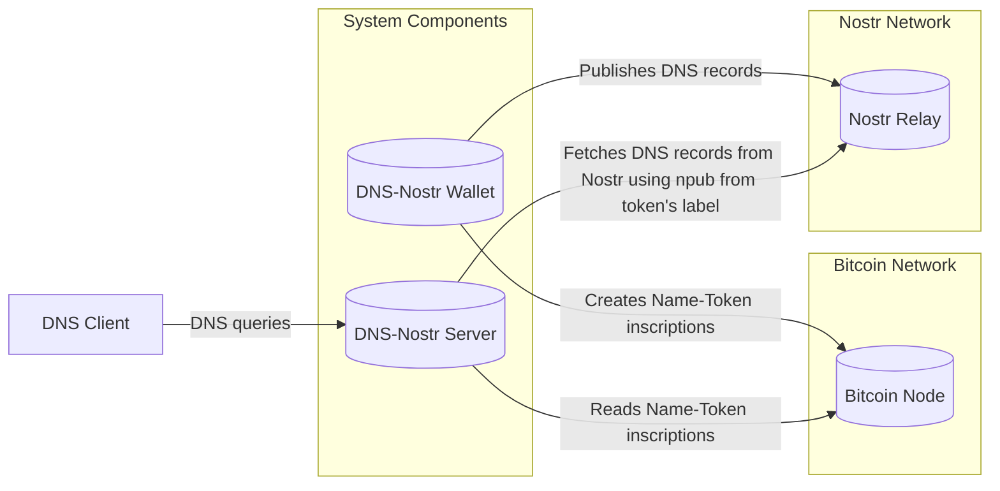

# Name-Tokens and DNS over Nostr

## Overview

This project introduces **Name-Tokens**, a novel and general protocol for
managing unique names and associating them with arbitrary data on the Bitcoin
blockchain. This protocol utilizes Bitcoin's inscription capabilities to embed
metadata within unspent transaction outputs (UTXOs), where each UTXO represents
a unique named token. The ownership and history of these named tokens are
immutably recorded on the blockchain.

Currently, this project focuses on a specific application of the Name-Tokens
protocol: **DNS over Nostr**. In this system, operators of Nostr-DNS servers can
enable the resolution of subdomains under their existing domains (e.g.,
`*.nostr.dns.app`, `*.name-token.com.br`) using the decentralized Nostr network.

In this application, a _label_ for a desired subdomain (e.g., `blog`) is
registered as a unique Bitcoin token using the _Nostr-DNS Wallet_. The
inscription within this token's UTXO links this label to a Nostr public key. The
wallet manages these labels as Name-Tokens and publishes associated DNS records
to Nostr using the linked public key.

Operators of _Nostr-DNS Servers_ configure their servers to serve DNS records
for subdomains under their control (e.g., `*.nostr.dns.app`, `*.dns-nostr.com`).
When a DNS query for such a subdomain (e.g., `blog.nostr.dns.app`) arrives,
their server queries the Bitcoin blockchain to find the Name-Token associated
with the label (e.g., `blog`). It then retrieves the linked Nostr public key
from the inscription and fetches the corresponding DNS records from the Nostr
network to respond to the DNS query.

The system consists of two main components: the Nostr-DNS Wallet, designed to
create and manage Name-Tokens representing subdomain labels, and the Nostr-DNS
Server, operated by domain owners to resolve these subdomains under its domains
based on these Name-Tokens.

## Features

### Nostr-DNS Wallet

- **Standard Bitcoin Wallet Functions**: Send and receive satoshis.
- **Nostr-DNS Name-Token** creation and management:
  - Create _Nostr-DNS Name-Tokens_ on the Bitcoin blockchain (representing labels for subdomains).
  - Update the Nostr public key associated with a _Nostr-DNS Name-Token_, effectively changing the owner of the DNS records in the Nostr Network, which requires creating a new inscription.
  - Transfer ownership of _Nostr-DNS Name-Tokens_ to other wallets.
  - Revoke _Nostr-DNS Name-Tokens_.
- **Nostr Integration**: Publish DNS records as text notes to a Nostr relay using the Nostr public key. This allows the Nostr-DNS server to fetch records from the Nostr network.

### Nostr-DNS Server

- **Name-Token Resolution:** Reads Bitcoin UTXOs by scanning the Bitcoin blockchain to find the mapping between named tokens (representing subdomain labels under the server owner's domain) and their associated Nostr public keys in the token's inscription.
- **Subdomain Resolution:** Specifically resolves subdomains formed by combining a registered label with the server owner's configured domain (e.g., `label.nostr.dns.app`). It fetches DNS records from a specific Nostr relay using the associated Nostr public key obtained from the Name-Token's inscription on the Bitcoin blockchain.
- **Support for Standard DNS Records:** Plans to support common DNS record types (A, AAAA, CNAME, NS, MX, TXT) for these subdomains.

## Architecture



The Nostr-DNS system leverages both the Bitcoin and Nostr networks through two
primary components: the Nostr-DNS Wallet and the Nostr-DNS Server.

The Nostr-DNS Wallet creates Name-Token inscriptions on the Bitcoin blockchain
to register subdomain labels and associate them with a Nostr public key. It also
publishes DNS records as text notes to the Nostr network using this public key.

The Nostr-DNS Server, operated by domain owners, reads these Name-Token
inscriptions from the Bitcoin blockchain to discover the mapping between
subdomain labels and Nostr public keys. When a DNS Client sends DNS queries for
a subdomain under its control, the server fetches the corresponding DNS records
from the Nostr network using the Nostr public key associated with the queried
label (obtained from the Name-Token's inscription).

## Name-Token Specification

### Principles

These principles govern the creation, management, and validity of named tokens within the "Name-Token" system:

1. **Names as Unique Tokens:** Each unique name is represented by a single, distinct Unspent Transaction Output (UTXO) on the Bitcoin blockchain. This UTXO _is_ the _Name-Token_.
2. **Inscribed Metadata:** All relevant metadata for a Name-Token, including the name itself and an associated arbitrary data, are permanently embedded within the UTXO's `scriptPubKey` using Bitcoin's inscription capabilities.
3. **UTXO Set as Chain State:** The current set of valid named tokens can always be determined by examining the active UTXO set of the Bitcoin blockchain. Only UTXOs conforming to the defined inscription format are considered valid Name-Tokens.
4. **Global Name Uniqueness:** For any given name, only one valid Name-Token can exist within the UTXO set at any time. This ensures that each name has a single, authoritative owner and associated data.
5. **First Confirmed Rule:** When a new name is inscribed for the first time, the earliest confirmed transaction creating such a token will be considered the valid registration. Subsequent attempts to inscribe the same name in new UTXOs will be disregarded unless they follow the update process or if the UTXO of the initially valid token is subsequently revoked. In such a case, the next earliest confirmed, non-revoked inscription for that name would become the valid token.
6. **Update via Spending and Reinscription:** To update the data associated with a named token, a new Bitcoin transaction must be created that spends the UTXO of the current inscription. This transaction must also include an output containing a new inscription with the same name and the updated associated data, effectively overriding the previous association.
7. **Positional Update Correlation:** A single Bitcoin transaction can update multiple named tokens. To achieve this, the Nth output containing the new inscription for a specific token must correspond to the Nth input that spends the UTXO of that token's previous inscription. For example, to update two tokens, 'blog' and 'profile', the first input spends the 'blog' token's UTXO, and the first output is the new 'blog' inscription. Similarly, the second input spends the 'profile' token's UTXO, and the second output is the new 'profile' inscription. Careful transaction construction is required to ensure this positional relationship is maintained for each updated token.
8. **Revocation as Spending:** To revoke a named token, the owner must create a new transaction that spends the UTXO of the current inscription. This transaction should not include a new inscription for the same name, effectively invalidating the previous association and marking it as revoked. This differs from updating, where a new inscription with the same name is created.

### Inscription Format

The metadata for each Name-Token is embedded within the `scriptPubKey` of one of
the outputs of the Bitcoin transaction that creates or updates the token. This
is typically achieved using an `OP_RETURN` output or a similar mechanism, such as
embedding data in taproot script-path spends. These methods allow for embedding
arbitrary data in a way that doesn't interfere with standard Bitcoin transaction
processing but can be identified by compliant software.

The inscription follows a structured format using `OP_FALSE OP_IF ... OP_ENDIF`
to conditionally execute the data pushes. This structure ensures that standard
Bitcoin nodes treat the data within the IF block as a no-operation, while
compliant software can interpret it.

The general structure of the Name-Token inscription is as follows:

```bash
OP_FALSE
OP_IF
  OP_PUSH "name"            # Namespace identifier (ASCII string)
  OP_PUSH $label            # Represents the subdomain (e.g., "blog") - follows RFC-1034 and lowercase
  OP_0                      # Section separator (OP_0 opcode)
  OP_PUSH $section_protocol # Identifier for the protocol using this token's data (ASCII string, e.g., "dns-nostr")
  OP_PUSH $argument_0       # Protocol-specific argument (format depends on <section_protocol>)
  # ...
  # Additional protocol-specific sections can be added, each preceded by OP_0
OP_ENDIF
```

The fields explanation is as follows:

- name: A fixed ASCII string identifying this output as containing Name-Token metadata.
- `$label`: The unique UTF-8 string representing the name of the token (e.g., "mydomain").
- `OP_0`: An opcode used as a separator between different sections of the inscription. This allows for extensibility and the potential inclusion of data for different protocols associated with the same Name-Token in the future.
- `$section_protocol`: An ASCII string identifying the protocol for which the subsequent arguments are intended (e.g., "dns-nostr").
- `$argument_0`: The first argument specific to the protocol defined in `$section_protocol`. The format and number of arguments depends on the protocol.

### DNS-Nostr Inscription Protocol

A UTXO inscribed with the _DNS-Nostr_ protocol section within the Name-Token
inscription is referred to as a DNS-Nostr token. For these tokens, the
`$section_protocol` field will be set to `"dns-nostr"`, and the first argument
(`$argument_0`) will be the raw hexadecimal representation of the Nostr public
key associated with the token.

```bash
OP_FALSE
OP_IF
  OP_PUSH "name"
  OP_PUSH $label            # Should follow RFC-1034 DNS rules for labels and use downcase letters
  OP_0
  OP_PUSH "dns-nostr"
  OP_PUSH $nostr_pubkey_hex # Raw hexadecimal representation of the Nostr public key
OP_ENDIF
```

To ensure compatibility with standard DNS practices defined in RFC-1034, the
`$label` for `.dns-nostr` domains must adhere to DNS label rules: it should consist
of lowercase letters (a-z), digits (0-9), and hyphens (-), start with a letter,
and be no more than 63 characters in length. The requirement for lowercase is
also due to the case-insensitive nature of DNS, promoting consistency within the
Name-Token system.

<!--
Getting Started: Instructions on how someone can start using the Nostr-DNS Wallet (if it's publicly available) or how a domain owner can set up a Nostr-DNS Server.

Installation: If there are any software components, detail the installation process.

Usage: Provide examples of how to register a subdomain label using the wallet and how a DNS query would be handled by the server.

Architecture (Optional but Recommended): A more detailed diagram or explanation of the interaction between the wallet, Bitcoin blockchain, Nostr network, and DNS servers could be beneficial.

Roadmap (Optional): If you have future plans for the project or the Name-Tokens protocol, outlining them can generate interest.

Contributing (Optional): If you plan to accept contributions, provide guidelines for developers.

License: Specify the licensing for your project.

Disclaimer: If the project is experimental or has any limitations, it's good practice to include a disclaimer.
-->
