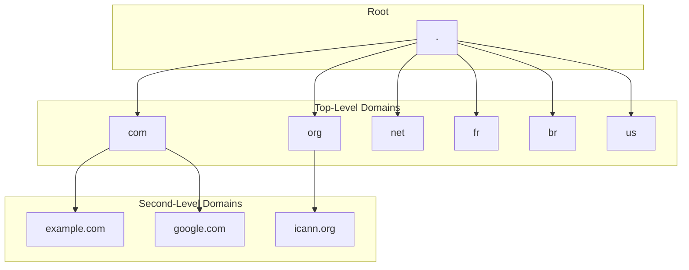

# Nostr-DNS

## Abstract

### Problem Description

Traditional DNS systems rely on hierarchical and centralized trust models,
introducing single points of failure, censorship risks, and reliance on
certificate authorities. Efforts to decentralize DNS have emerged over time, but
many face usability or coordination challenges. A key missing element is a
reliable, censorship-resistant method for cryptographically proving domain
ownership without relying on centralized registrars.

### Proposed Solution

This project explores the development of a decentralized DNS service in which
ownership of subdomains is anchored in the Bitcoin blockchain and DNS records
are stored as Nostr events on relays.

Domain ownership is established and proven through Bitcoin transactions, where
the possession of a particular UTXO corresponds to control over a given
subdomain. This model mirrors some of the mechanics behind NFTs, where a
spendable output acts as a transferable token of ownership.

DNS record metadata—such as IP addresses, TXT records, and service declarations
is published using the Nostr protocol. Using Nostr relays allows DNS records to
be widely distributed, tamper-resistant, and resilient to censorship.
Verification of domain record authenticity is made possible by linking the
signature of the Nostr events to the corresponding Bitcoin UTXO holder.

### Potential Impact

DNS-Nostr presents a novel, user-controlled model for DNS that combines the
censorship resistance and immutability of Bitcoin with the real-time, flexible
publish-subscribe capabilities of Nostr. It offers an alternative naming and
resolution infrastructure for applications seeking trust minimization and
resilience. This project could be a foundation for decentralized websites,
identity systems, and service directories rooted in Bitcoin-native ownership
semantics.

## 1. What is my problem?

### 1.1 What is DNS?

Imagine the internet as a giant city. Every house (website) has a unique address
(IP address), a long string of numbers that can be difficult to remember and
even trickier to type. This is where the Domain Name System (DNS) comes in. It
acts like the phone book of this city, translating user-friendly domain names
(like "example.com" or "google.com") into those complex IP addresses that
computers understand. [^ref:cloudflare-what_is_dns]

This system is crucial because it allows us to navigate the internet using words
and phrases we can remember instead of memorizing long strings of numbers.
Additionally, DNS offers another advantage when IP addresses can change over
time. By acting like an alias for computers providing services, DNS allows
updates in the link between the domain name and the service's IP address without
affecting how users access it. So, even if the "house" (server) moves locations
(changes its IP), users can still find it using the familiar domain name they've
always known. [^ref:cloudflare-what_is_dns]

The fundamental design goals of the DNS, as outlined in RFC 1034
[^ref:rfc_1034], emphasize consistency and broad utility. The primary aim was to
create a consistent naming space for referring to various resources, ensuring
that names wouldn't be tied to specific network identifiers, addresses, or
routes. This design choice allowed names to remain stable even if the underlying
network infrastructure changed.

Furthermore, the architects of DNS intended it to be generally helpful and not
limited to a single application. As RFC 1034 states, using names to retrieve
host addresses, mailbox data, and other undetermined information should be
possible. This forward-thinking design ensures that any data associated with a
name is tagged with a specific type, allowing queries to be precisely limited to
the information desired. This highlights DNS's role not just as an IP address
lookup service but as a flexible system capable of associating diverse types of
information with unique names on the internet.

Currently, the DNS is a hierarchical system of databases with a top-down,
hierarchical structure, starting from the broadest level and progressively
narrowing down to specific hosts. This hierarchy begins with the DNS root zone,
managed by the Internet Assigned Numbers Authority (IANA)
[^ref:iana-root_zone_management]. Below the root are the top-level domain names
(TLDs), encompassing generic categories like ".com", ".org", and ".net", as well
as two-letter country codes from ISO-3166 (e.g., ".fr", ".br", ".us")
[^ref:iso_3166]. Each TLD is administered by a designated entity, which then
further delegates management of subdomains, effectively forming a multi-level
tree. These administrators play a crucial role in managing portions of the
naming tree, performing a public service on behalf of the Internet community
[^ref:rfc_1591].



### 1.2 How does DNS work?

As defined by RFC 1034 [^ref:rfc_1034], the DNS system comprises three major
elements: the Domain Name Space and Resource Records, Name Servers, and
Resolvers. These elements collectively establish and manage a consistent naming
space for referring to various resources, allowing for the retrieval of
associated information without names being rigidly tied to a specific network
identifiers or addresses.

The domain name space forms a crucial part of this structure, serving as a
hierarchical, tree-structured system where each node or leaf conceptually names
a set of information. This space and its associated resource records define the
types of data that can be linked to a domain name. When a query is initiated, it
targets a specific domain name and requests a particular type of resource
information. For instance, the internet commonly uses domain names to identify
hosts and queries for "address resources" (A records) will return the
corresponding IP addresses. This flexible design allows DNS to store various
kinds of information beyond host addresses, such as mailbox data (MX records) or
descriptive text (TXT records), all tagged by their specific type, allowing for
precise queries.

Name servers interact with this namespace, which are specialized programs that
maintain information about the domain tree's structure and associated data.
While a name server can cache information from any part of the domain tree, each
typically holds complete and definitive information for a specific subset of the
domain space. A name server is considered an authority for these particular
namespace portions. This authoritative information is organized into distinct
units called zones, which can be automatically distributed among multiple name
servers to provide redundant service and ensure data availability. Critically,
name servers can also give pointers to other name servers, guiding a resolver
toward the authoritative source for information not held locally.

Finally, resolvers act as the intermediaries between user programs and name
servers. These are typically system routines designed to extract information
from name servers in response to client requests. A resolver's primary role is
to access at least one name server and directly answer a query from its cached
data or pursue it by following referrals to other name servers in the DNS
hierarchy. This design means that users interact with the DNS system indirectly
through their local resolver, abstracting away the complex process of traversing
the name server network.

These three components correspond to different perspectives within the
domain system. From a user's point of view, the DNS is a unified, accessible
tree where information can be requested from any part via a simple call to a
local resolver. For the resolver, the system appears as a collection of
potentially many name servers, each holding a piece of the overall domain tree's
data, which the resolver treats as largely static databases. However, from the
perspective of a name server itself, the system consists of distinct, local
information sets called zones, which it must periodically update from master
copies while concurrently processing queries from resolvers.

When you type a domain name into your browser, a series of steps occur
leveraging these components:

1. Request Initiation: Your computer, as DNS client sends a query to a DNS
   resolver, often provided by your internet service provider (ISP).
   [^ref:rfc_2132]
2. If the local DNS resolver does not have the requested information in its
   cache, it initiates a recursive query process on behalf of the DNS client. It
   begins this process by contacting one of the root name servers. The recursive
   resolver is preconfigured with the IANA's "root hints file", which contains
   the names and IP addresses of the authoritative name servers for the root
   zone.
3. TLD Name Servers: The resolver then queries the appropriate TLD name server,
   which directs it to the authoritative name servers for the specific domain
   (e.g., "example.com").
4. Authoritative Name Server: Finally, the resolver queries the authoritative
   name server, which holds the actual DNS records (like the IP address) for
   that domain.
5. Response and Caching: The answer is returned to your resolver, then to your
   computer, and is often cached along the way for faster future lookups.


Crucially, for a domain owner to make their website or service accessible, they
must publish their DNS records with their chosen DNS service provider (often a
registrar or a specialized DNS host). These providers typically store the zone
information, including all associated resource records (e.g., A, AAAA, CNAME,
MX, TXT records), in master files [^ref:rfc1035]. As defined in RFC 1035, these
master files are text files that contain RRs in a standardized text format,
serving as the primary means to define a zone's contents for a name server. The
owner must make any changes or updates to these records through this provider,
which then propagates the updates to the global DNS system.

To illustrate the structure of a typical DNS master file, consider the following
example for <example.com>:

```dns
; Start of Authority (SOA) Record: Defines the primary name server and administrative details for the zone.
@       IN  SOA (
                    ns.icann.org.       ; Primary name server
                    noc.dns.icann.org.  ; E-mail of the administrator is noc@dns.icann.org.
                    2025011653          ; Serial number (typically YYYYMMDDNN)
                    7200                ; Refresh (seconds)
                    3600                ; Retry (seconds)
                    1209600             ; Expire (seconds)
                    3600                ; Minimum TTL (seconds)
                )

; Address (A) Records: Maps a domain name to an IPv4 address.
@       IN A     23.192.228.84  ; example.com maps to this IP address
www     IN A     201.30.129.137 ; www.example.com maps to this IP address
mail    IN A     96.7.128.198   ; mail.example.com maps to this IP address

; IPv6 Address (AAAA) Records: Maps a domain name to an IPv6 address.
@       IN  AAAA    2600:1408:ec00:36::1736:7f24
www     IN  AAAA    2600:1406:3a00:21::173e:2e65

; Mail Exchanger (MX) Records: Specifies mail servers for the domain.
; The number (e.g., 10) is the preference value; lower numbers are preferred.
@       IN  MX      10  mail ; example.com uses mail.example.com as its mail server

; Canonical Name (CNAME) Record: Creates an alias from one domain name to another.
ftp     IN  CNAME   example.com. ; ftp.example.com is an alias for example.com

; Text (TXT) Records: Stores arbitrary text data, often used for verification or policy.
@       IN  TXT     "_k2n1y4vw3qtb4skdx9e7dxt97qrmmq9"
@       IN  TXT     "v=spf1 -all"
_dmarc  IN  TXT     "v=DMARC1;p=reject;sp=reject;adkim=s;aspf=s"; DMARC policy
```

### 1.3 Problems with DNS

While the Domain Name System (DNS) is crucial for the internet's functionality,
its inherently centralized control points, particularly at the root level,
introduce significant vulnerabilities and challenges. The Internet Assigned
Numbers Authority (IANA), operating under the Internet Corporation for Assigned
Names and Numbers (ICANN) manages the DNS root zone. This centralized
coordination is broadly recognized as indispensable for maintaining global
internet stability and interoperability, ensuring the consistent application of
unique identifiers worldwide [^ref:iana-about].

However, this centrality, despite the geographically distributed nature of
root server instances, creates complex problems and risks. The primary concerns
revolve around the potential for IANA's functions to act as a single point of
failure (SPOF) for the internet's technical infrastructure, specifically at the
policy and data management layers [^ref:old_dominion-brief_review_of_dns]. In other words, while individual root servers are robust against physical attacks,
the vulnerability lies in centralized control over the authoritative root
zone file, which defines the internet's top-level structure. This singular point
of control can be leveraged for political influence
[^ref:old_dominion-brief_review_of_dns].

This centralized control also exposes the DNS to the risk of political influence
and censorship, fundamentally undermining the internet's core principles of
openness and neutrality and also leads to increased internet fragmentation,
often referred to as the "Splinternet," which jeopardizes global
interoperability and communication [^ref:european_union-internet_governance].

A direct consequence of this centralization is DNS-based blocking and
manipulation, a prevalent method of internet censorship. This operates by
interfering with the DNS resolution process, the initial step in accessing any
online resource. When a user attempts to access a censored website, the DNS
server can be configured to fail to return an IP address, redirect the user to
an alternative page (like a government-approved message), or even point to a
fake version of the prohibited website [^ref:tatua-what_is_censorship]. Such
interference is most commonly enforced at the Internet Service Provider (ISP)
level, as ISPs can compel their customers' devices to use their designated DNS
servers, thus gaining control over the resolution process.

Real-world incidents vividly illustrate these vulnerabilities, especially
concerning internet routing manipulation. For example, in November 2021, users
in Mexico received bogus DNS responses for whatsapp.net. This occurred due to a
BGP (Border Gateway Protocol) route leak. BGP is the internet's fundamental
routing protocol for exchanging path information between different networks
(Autonomous Systems). A route leak happens when a network incorrectly advertises
routes for IP addresses it doesn't legitimately control, or for paths it
shouldn't propagate. In this incident, the BGP route leak inadvertently diverted
DNS queries destined for <whatsapp.net> to a local instance of a root name
server in China. These rerouted queries then encountered "middleboxes" (network
devices designed to inspect and sometimes alter traffic) that injected fake DNS
responses [^ref:delft_university-intercept_adn_inject]. Similar root traffic
manipulations were reported in 2010 and 2011, where other BGP route leaks made
China-located root instances globally available, leading to queries for domains
like twitter.com and facebook.com being answered with incorrect IP addresses
[^ref:delft_university-intercept_adn_inject]. More recently, in August 2024,
Brazil's Supreme Court imposed a ban on X (formerly Twitter), with ISPs
compelled to block access by configuring their DNS systems to not serve IP
addresses for the platform [^ref:reason_foundation-x_ban]
[^ref:olhar_digital-como_e_feito_o_bloqueio].

## 2. What is the solution to my problem?

<!-- Could blockchain (really) replace DNS? https://www.afnic.fr/wp-media/uploads/2024/06/Could-Blockchain-really-replace-DNS-Afnic-Issue-Paper.pdf -->
<!-- What is Bitcoin? -->
<!-- What are the Bitcoin properties wanted? -->
<!-- What is Nostr? -->
<!-- What are the properties wanted from Nostr -->
<!-- BTC + Nost, How they fit together? -->

## 3. My solution solves the problem?
<!-- Does DNS becomes more uncensorable? -->
<!-- Problems with the solution -->
<!-- You still have to   -->

## References

[ref:cloudflare-what_is_dns]: [Cloudflare; What is DNS? | How DNS works](https://www.cloudflare.com/learning/dns/what-is-dns/)

[ref:rfc_1034]: [DOMAIN NAMES - IMPLEMENTATION AND SPECIFICATION](https://www.ietf.org/rfc/rfc1034.txt)

[ref:iana-root_zone_management]: [IANA; Root Zone Management](https://www.iana.org/domains/root)

[ref:iso_3166]: [ISO 3166 - Códigos de país](https://www.iso.org/iso-3166-country-codes.html)

[ref:rfc_1591]: [Domain Name System Structure and Delegation](https://www.ietf.org/rfc/rfc1591.txt)

[ref:rfc_2132]: [DHCP Options and BOOTP Vendor Extensions](https://www.ietf.org/rfc/rfc2132.txt)

[ref:iana-about]: [IANA - About us](https://www.iana.org/about)

[ref:old_dominion-brief_review_of_dns]: [A Brief Re A Brief Review of DNS, Root Ser view of DNS, Root Servers, Vulnerabilities and abilities and Decentralization](https://digitalcommons.odu.edu/cgi/viewcontent.cgi?article=1014&context=covacci-undergraduateresearch)

[ref:european_union-internet_governance]: [European Union; Internet Governance](https://www.europarl.europa.eu/RegData/etudes/BRIE/2024/766272/EPRS_BRI(2024)766272_EN.pdf)

[ref:tatua-what_is_censorship]: [tatua; What is Censorship and What Tools Can SJOs Use to Bypass Restricted Content?](https://tatua.digital/services/what-is-censorship-and-what-tools-can-sjos-use-to-bypass-restricted-content/)

[ref:delft_university-intercept_and_inject]: [Delft University of Technology; Intercept and Inject](https://pure.tudelft.nl/ws/portalfiles/portal/151232870/978_3_031_28486_1_19.pdf)

[ref:reason_foundation-x_ban]: [Reason Foundation; How Brazil’s X ban signals growing control over online free speech](https://reason.org/commentary/how-brazils-x-ban-signals-growing-control-over-online-free-speech/)

[ref:olhar_digital-como_e_feito_o_bloqueio]: [Olhar Digital; Como é feito o bloqueio de uma rede social no Brasil?](https://olhardigital.com.br/2024/08/29/pro/como-e-feito-o-bloqueio-de-uma-rede-social-no-brasil)
