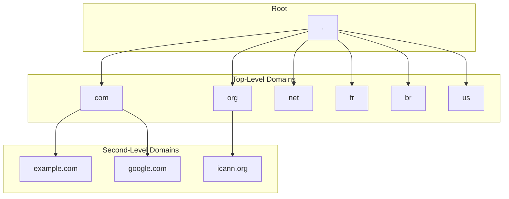
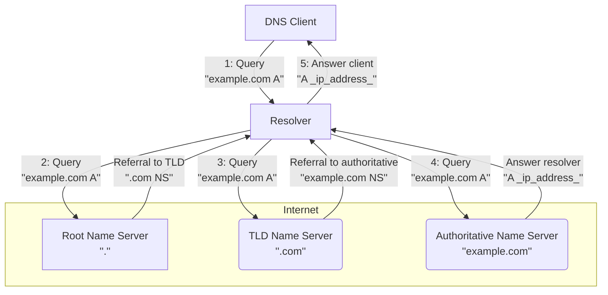

# Nostr-DNS

## Abstract

### Problem Description

Traditional DNS systems rely on hierarchical and centralized trust models,
introducing single points of failure, censorship risks, and reliance on
certificate authorities. Efforts to decentralize DNS have emerged over time, but
many face usability or coordination challenges. A key missing element is a
reliable, censorship-resistant method for cryptographically proving domain
ownership without relying on centralized registrars.

### Proposed Solution

This project explores the development of a decentralized DNS service in which
ownership of subdomains is anchored in the Bitcoin blockchain and DNS records
are stored as Nostr events on relays.

Domain ownership is established and proven through Bitcoin transactions, where
the possession of a particular UTXO corresponds to control over a given
subdomain. This model mirrors some of the mechanics behind NFTs, where a
spendable output acts as a transferable token of ownership.

DNS record metadata—such as IP addresses, TXT records, and service declarations
is published using the Nostr protocol. Using Nostr relays allows DNS records to
be widely distributed, tamper-resistant, and resilient to censorship.
Verification of domain record authenticity is made possible by linking the
signature of the Nostr events to the corresponding Bitcoin UTXO holder.

### Potential Impact

DNS-Nostr presents a novel, user-controlled model for DNS that combines the
censorship resistance and immutability of Bitcoin with the real-time, flexible
publish-subscribe capabilities of Nostr. It offers an alternative naming and
resolution infrastructure for applications seeking trust minimization and
resilience. This project could be a foundation for decentralized websites,
identity systems, and service directories rooted in Bitcoin-native ownership
semantics.

## 1. What is my problem?

### 1.1 What is DNS?

Imagine the internet as a giant city. Every house (website) has a unique address
(IP address), a long string of numbers that can be difficult to remember and
even trickier to type. This is where the Domain Name System (DNS) comes in. It
acts like the phone book of this city, translating user-friendly domain names
(like "example.com" or "google.com") into those complex IP addresses that
computers understand.[^cloudflare-what_is_dns]

This system is crucial because it allows us to navigate the internet using words
and phrases we can remember instead of memorizing long strings of numbers.
Additionally, DNS offers another advantage when IP addresses can change over
time. By acting like an alias for computers providing services, DNS allows
updates in the link between the domain name and the service's IP address without
affecting how users access it. So, even if the "house" (server) moves locations
(changes its IP), users can still find it using the familiar domain name they've
always known.[^cloudflare-what_is_dns]

The fundamental design goals of the DNS, as outlined in RFC 1034[^rfc_1034],
emphasize consistency and broad utility. The primary aim was to create a
consistent naming space for referring to various resources, ensuring that names
wouldn't be tied to specific network identifiers, addresses, or routes. This
design choice allowed names to remain stable even if the underlying network
infrastructure changed.

Furthermore, the architects of DNS intended it to be generally helpful and not
limited to a single application. As RFC 1034 states, using names to retrieve
host addresses, mailbox data, and other undetermined information should be
possible. This forward-thinking design ensures that any data associated with a
name is tagged with a specific type, allowing queries to be precisely limited to
the information desired. This highlights DNS's role not just as an IP address
lookup service but as a flexible system capable of associating diverse types of
information with unique names on the internet.

Currently, the DNS is a hierarchical system of databases with a top-down,
hierarchical structure, starting from the broadest level and progressively
narrowing down to specific hosts. This hierarchy begins with the DNS root zone,
managed by the Internet Assigned Numbers Authority
(IANA)[^iana-root_zone_management]. Below the root are the top-level domain
names (TLDs), encompassing generic categories like ".com", ".org", and ".net",
as well as two-letter country codes from ISO-3166 (e.g., ".fr", ".br",
".us")[^iso_3166]. Each TLD is administered by a designated entity, which then
further delegates management of subdomains, effectively forming a multi-level
tree. These administrators play a crucial role in managing portions of the
naming tree, performing a public service on behalf of the Internet
community[^rfc_1591].



### 1.2 How does DNS work?

As defined by RFC 1034 [^rfc_1034], the DNS system comprises three major
elements: the Domain Name Space and Resource Records, Name Servers, and
Resolvers. These elements collectively establish and manage a consistent naming
space for referring to various resources, allowing for the retrieval of
associated information without names being rigidly tied to a specific network
identifiers or addresses.

The domain name space forms a crucial part of this structure, serving as a
hierarchical, tree-structured system where each node or leaf conceptually names
a set of information. This space and its associated resource records define the
types of data that can be linked to a domain name. When a query is initiated, it
targets a specific domain name and requests a particular type of resource
information. For instance, the internet commonly uses domain names to identify
hosts and queries for "address resources" (A records) will return the
corresponding IP addresses. This flexible design allows DNS to store various
kinds of information beyond host addresses, such as mailbox data (MX records) or
descriptive text (TXT records), all tagged by their specific type, allowing for
precise queries.

Name servers interact with this namespace, which are specialized programs that
maintain information about the domain tree's structure and associated data.
While a name server can cache information from any part of the domain tree, each
typically holds complete and definitive information for a specific subset of the
domain space. A name server is considered an authority for these particular
namespace portions. This authoritative information is organized into distinct
units called zones, which can be automatically distributed among multiple name
servers to provide redundant service and ensure data availability. Critically,
name servers can also give pointers to other name servers, guiding a resolver
toward the authoritative source for information not held locally.

Finally, resolvers act as the intermediaries between user programs and name
servers. These are typically system routines designed to extract information
from name servers in response to client requests. A resolver's primary role is
to access at least one name server and directly answer a query from its cached
data or pursue it by following referrals to other name servers in the DNS
hierarchy. This design means that users interact with the DNS system indirectly
through their local resolver, abstracting away the complex process of traversing
the name server network.

These three components correspond to different perspectives within the
domain system. From a user's point of view, the DNS is a unified, accessible
tree where information can be requested from any part via a simple call to a
local resolver. For the resolver, the system appears as a collection of
potentially many name servers, each holding a piece of the overall domain tree's
data, which the resolver treats as largely static databases. However, from the
perspective of a name server itself, the system consists of distinct, local
information sets called zones, which it must periodically update from master
copies while concurrently processing queries from resolvers.

When you type a domain name into your browser, a series of steps occur
leveraging these components:

1. Request Initiation: Your computer, as DNS client sends a query to a DNS
   resolver, often provided by your internet service provider (ISP).
   [^rfc_2132]
2. If the local DNS resolver does not have the requested information in its
   cache, it initiates a recursive query process on behalf of the DNS client. It
   begins this process by contacting one of the root name servers. The recursive
   resolver is preconfigured with the IANA's "root hints file", which contains
   the names and IP addresses of the authoritative name servers for the root
   zone.
3. TLD Name Servers: The resolver then queries the appropriate TLD name server,
   which directs it to the authoritative name servers for the specific domain
   (e.g., "example.com").
4. Authoritative Name Server: Finally, the resolver queries the authoritative
   name server, which holds the actual DNS records (like the IP address) for
   that domain.
5. Response and Caching: The answer is returned to your resolver, then to your
   computer, and is often cached along the way for faster future lookups.



Crucially, for a domain owner to make their website or service accessible, they
must publish their DNS records with their chosen DNS service provider (often a
registrar or a specialized DNS host). These providers typically store the zone
information, including all associated resource records (e.g., A, AAAA, CNAME,
MX, TXT records), in master files[^rfc_1035]. As defined in RFC 1035, these
master files are text files that contain RRs in a standardized text format,
serving as the primary means to define a zone's contents for a name server. The
owner must make any changes or updates to these records through this provider,
which then propagates the updates to the global DNS system.

To illustrate the structure of a typical DNS master file, consider the following
example for <example.com>:

```dns
; Start of Authority (SOA) Record: Defines the primary name server and administrative details for the zone.
@       IN  SOA (
                    ns.icann.org.       ; Primary name server
                    noc.dns.icann.org.  ; E-mail of the administrator is noc@dns.icann.org.
                    2025011653          ; Serial number (typically YYYYMMDDNN)
                    7200                ; Refresh (seconds)
                    3600                ; Retry (seconds)
                    1209600             ; Expire (seconds)
                    3600                ; Minimum TTL (seconds)
                )

; Address (A) Records: Maps a domain name to an IPv4 address.
@       IN A     23.192.228.84  ; example.com maps to this IP address
www     IN A     201.30.129.137 ; www.example.com maps to this IP address
mail    IN A     96.7.128.198   ; mail.example.com maps to this IP address

; IPv6 Address (AAAA) Records: Maps a domain name to an IPv6 address.
@       IN  AAAA    2600:1408:ec00:36::1736:7f24
www     IN  AAAA    2600:1406:3a00:21::173e:2e65

; Mail Exchanger (MX) Records: Specifies mail servers for the domain.
; The number (e.g., 10) is the preference value; lower numbers are preferred.
@       IN  MX      10  mail ; example.com uses mail.example.com as its mail server

; Canonical Name (CNAME) Record: Creates an alias from one domain name to another.
ftp     IN  CNAME   example.com. ; ftp.example.com is an alias for example.com

; Text (TXT) Records: Stores arbitrary text data, often used for verification or policy.
@       IN  TXT     "_k2n1y4vw3qtb4skdx9e7dxt97qrmmq9"
@       IN  TXT     "v=spf1 -all"
_dmarc  IN  TXT     "v=DMARC1;p=reject;sp=reject;adkim=s;aspf=s"; DMARC policy
```

### 1.3 Problems with DNS

While the Domain Name System (DNS) is foundational to the internet's global
functionality, its inherent centralized control points, particularly at the root
At this level, it introduces significant political vulnerabilities and risks.
The Internet Assigned Numbers Authority (IANA), operating under the Internet
Corporation for Assigned Names and Numbers (ICANN) manages the DNS root zone.
Although this centralized coordination is broadly deemed indispensable for
global internet stability and interoperability, ensuring consistent unique
identifiers worldwide[^iana-about], it simultaneously creates a crucial point of
leverage for political influence.

The primary concern is that IANA's functions represent a single point of failure
(SPOF) not necessarily in terms of technical resilience against physical
attacks, but critically at the policy and data management
layers[^old_dominion-brief_review_of_dns]. This centralized control over the
authoritative root zone file—which dictates the internet's top-level
structure—exposes the entire system to political pressure, manipulation, and
censorship. Such vulnerabilities fundamentally undermine the internet's core
principles of openness and neutrality, contributing to the increasing threat of
Internet fragmentation, often termed the "Splinternet," which jeopardizes global
interoperability and communication[^european_union-internet_governance]. The
historical role of the U.S. government and ongoing concerns about its influence
over ICANN, despite the multi-stakeholder model, further highlight that control
in Internet governance is a complex sociotechnical and political issue,
extending beyond mere technical operations.

A direct manifestation of this political vulnerability is DNS-based blocking and
manipulation, a prevalent method of internet censorship. This process interferes
with DNS resolution, the initial step in accessing online resources. Authorities
can compel Internet Service Providers (ISPs) to configure their DNS servers to
prevent access to specific websites—either by failing to return an IP address,
redirecting users to government-approved pages, or even to deceptive fake
versions of the site [^tatua-what_is_censorship]. ISPs' ability to mandate
the use of their designated DNS servers for customer devices provides them with
a powerful mechanism for control and censorship.

Real-world incidents vividly illustrate how these centralized control points
enable political and state-level interference. For instance, in November 2021,
users in Mexico received bogus DNS responses for <whatsapp.net>. This was caused
by a BGP (Border Gateway Protocol) route leak, where a network inadvertently or
intentionally advertised incorrect routing information. This misdirection
diverted DNS queries to a local instance of a root name server located in China.
These rerouted queries then passed through middleboxes—network devices that can
inspect and alter traffic—which injected fake DNS
responses[^delft_university-intercept_and_inject]. Similar incidents of BGP
route leaks leading to DNS manipulation by state-controlled infrastructure in
China were reported in 2010 and 2011, affecting domains like <twitter.com> and
<facebook.com>[^delft_university-intercept_and_inject]. More recently, in In
August 2024, Brazil's Supreme Court imposed a ban on X (formerly Twitter),
compelling ISPs to block access by configuring their DNS systems to withhold the
platform's IP addresses [^reason_foundation-x_ban]
[^olhar_digital-como_e_feito_o_bloqueio].

Beyond direct censorship, the current DNS system also suffers from a significant
lack of transparency and accountability. Decisions regarding domain
registrations, updates, and resolutions are frequently made within the opaque
confines of domain registrars and governing bodies, offering end-users limited
insight into these processes. This opacity further underscores the systemic
weaknesses in the DNS ecosystem's security, resilience, and trustworthiness.

These examples underscore that despite its technical distribution, the DNS's
centralized governance and operational choke points pose significant threats to
Internet freedom, accessibility, and neutrality, highlighting an urgent need for
more resilient and decentralized naming solutions.

## 2. What is the solution to my problem?

To address the inherent vulnerabilities and centralized control points of the
traditional Domain Name System (DNS), blockchain-based naming systems (BDNS)
offer a paradigm shift. This approach leverages blockchain technology to
architect a more resilient, secure, and censorship-resistant internet naming
infrastructure, liberating the system from its reliance on central authorities
like ICANN, domain registries, and registrars [^afnic-blockchain_replace_dns].

The core tenets of blockchain—decentralization, immutability, and cryptographic
security—directly counteract the weaknesses of the current DNS. By recording and
replicating information across a distributed network of nodes, a BDNS eliminates
the single points of failure that make the traditional system susceptible to
technical outages and political pressure [^southampton-blockchain_based_dns].
This distributed architecture not only enhances resilience against attacks like
Distributed Denial of Service (DDoS) it also renders the data exceptionally
difficult to falsify [^afnic-blockchain_replace_dns]. Consequently, it becomes
nearly impossible for any single entity to block, seize, or censor a domain name
through administrative or legal coercion—a direct countermeasure to the
censorship mechanisms prevalent today [^afnic-blockchain_replace_dns].

Furthermore, using an immutable public ledger enhances the security and
transparency of the entire domain management lifecycle. Every registration and
modification is recorded as a cryptographically secured transaction, creating a
tamper-proof and auditable ownership history. BDNS allows network participants
to independently validate domain ownership and data integrity without trusting a
central intermediary [^southampton-blockchain_based_dns].

This unique, verifiable, and user-controlled digital ownership model finds a
natural and robust technical implementation in Non-Fungible Tokens (NFTs). An
NFT is a unique cryptographic token on a blockchain that represents ownership of
a specific asset, such as a domain name [^open_sea-what_are_nft_domain_names].
The "non-fungible" property is critical; just as every domain name (e.g.,
example.com) is unique, each NFT is distinct and cannot be interchanged on a
one-to-one basis, making them ideally suited to represent exclusive domain
ownership [^open_sea-what_is_nft?]. This model transforms domain ownership from
a temporary lease, contingent on periodic renewals with a registrar, into a
persistent digital asset fully controlled by the user. This shift to actual
ownership is a foundational principle of the proposed solution
[^open_sea-what_are_nft_domain_names].

While numerous blockchains can support NFTs, Bitcoin presents a particularly
compelling foundation for a global naming system. Launched in 2009 by Satoshi
Nakamoto, Bitcoin's defining feature is its unparalleled security, which is a
direct function of its Proof of Work (PoW) consensus mechanism
[^satoshi-nakamoto_bitcoin]. The immense and continuously accumulating
computational work required to validate transactions makes the Bitcoin's
blockchain extraordinarily resistant to attack and manipulation, providing the
robust foundation of trust necessary for critical infrastructure like DNS
[^van_eck-bitcoin_vs_ethereum].

Moreover, Bitcoin's long-standing market dominance and vast network effect
signal its stability and long-term viability, crucial attributes for a service
intended to be permanent and globally accessible
[^coinmarketcap-bitcoin_dominance]. By leveraging Bitcoin's native security,
this project proposes a system where domain ownership is anchored directly
on-chain. The following sections will detail how specific protocols built upon
Bitcoin can enable the inscription of these domain NFTs, establishing ownership
with an unprecedented level of immutability and censorship resistance, thereby
forming the core of the DNS-Nostr architecture.
<!-- 

### What is Bitcoin?

- Diferent from Ethereum, Bitcoin does not have smart contracts, so instead of creating a contract, it's need to discover how to make this type of nft in Bitcoin.
- Explain transactions,
- Explain Scripts,
- Explain Blockchain,
- What are the properties wanted from Bitcoin?

## Name Tokens Protocol

- Principles of the Name Tokens Protocol
- What is the Name Tokens Protocol?
- Why not place the records in the Bitcoin blockchain?
- An off chain solution.  

### What is Nostr?

- What are the properties wanted from Nostr?
- What are the properties wanted from Nostr

### DNS-Nostr Tokens Protocol

- How does the DNS-Nostr Tokens Protocol work?
- Full scenario of how the DNS-Nostr Tokens Protocol works.
  - Create a domain;
  - Resolve an dns query.
  - Update records;
  - Transfer domain ownership;
  - Revoke a domain;

-->

## 3. My solution solves the problem?
<!-- Does DNS becomes more uncensorable? -->
<!-- Problems with the solution -->
<!-- You still have to   -->

## References

<!-- # Introduction -->

[^cloudflare-what_is_dns]: [Cloudflare; What is DNS? | How DNS works](https://www.cloudflare.com/learning/dns/what-is-dns/)

[^rfc_1034]: [DOMAIN NAMES - IMPLEMENTATION AND SPECIFICATION](https://www.ietf.org/rfc/rfc1034.txt)

[^iana-root_zone_management]: [Root Zone Management](https://www.iana.org/domains/root)

[^iso_3166]: [ISO 3166 - Códigos de país](https://www.iso.org/iso-3166-country-codes.html)

[^rfc_1591]: [Domain Name System Structure and Delegation](https://www.ietf.org/rfc/rfc1591.txt)

[^rfc_2132]: [DHCP Options and BOOTP Vendor Extensions](https://www.ietf.org/rfc/rfc2132.txt)

[^rfc_1035]: [DOMAIN NAMES - IMPLEMENTATION AND SPECIFICATION](https://www.rfc-editor.org/rfc/rfc1035.html)

[^iana-about]: [IANA - About us](https://www.iana.org/about)

[^old_dominion-brief_review_of_dns]: [A Brief Re A Brief Review of DNS, Root Ser view of DNS, Root Servers, Vulnerabilities and abilities and Decentralization](https://digitalcommons.odu.edu/cgi/viewcontent.cgi?article=1014&context=covacci-undergraduateresearch)

[^european_union-internet_governance]: [European Union; Internet Governance](https://www.europarl.europa.eu/RegData/etudes/BRIE/2024/766272/EPRS_BRI(2024)766272_EN.pdf)

[^tatua-what_is_censorship]: [tatua; What is Censorship and What Tools Can SJOs Use to Bypass Restricted Content?](https://tatua.digital/services/what-is-censorship-and-what-tools-can-sjos-use-to-bypass-restricted-content/)

[^delft_university-intercept_and_inject]: [Delft University of Technology; Intercept and Inject](https://pure.tudelft.nl/ws/portalfiles/portal/151232870/978_3_031_28486_1_19.pdf)

[^reason_foundation-x_ban]: [Reason Foundation; How Brazil’s X ban signals growing control over online free speech](https://reason.org/commentary/how-brazils-x-ban-signals-growing-control-over-online-free-speech/)

<!-- ## What is the solution to my problem? -->

[^southampton-blockchain_based_dns]: [Blockchain-based DNS: Current Solutions and
Challenges to Adoption](https://ceur-ws.org/Vol-3791/paper16.pdf)

[^afnic-blockchain_replace_dns]: [Could blockchain really replace DNS?](https://www.afnic.fr/wp-media/uploads/2024/06/Could-Blockchain-really-replace-DNS-Afnic-Issue-Paper.pdf)

[^open_sea-what_are_nft_domain_names]: [OpenSea; What are NFT domain names?](https://opensea.io/learn/nft/what-are-nft-domain-names#:~:text=A%20domain%20name%20NFT%20stores,domain.)

[^open_sea-what_is_nft?]: [OpenSea; What is an NFT?](https://opensea.io/learn/nft/what-are-nfts)

[^satoshi-nakamoto_bitcoin]: [Satoshi Nakamoto; Bitcoin: A Peer-to-Peer Electronic Cash System](https://bitcoin.org/bitcoin.pdf)

[^van_eck-bitcoin_vs_ethereum]: [Van Eck Associates Corporation; Bitcoin vs. Ethereum in 2025: Comparison & Outlook](https://www.vaneck.com/us/en/blogs/digital-assets/bitcoin-vs-ethereum/)

[^coinmarketcap-bitcoin_dominance]: [CoinMarketCap; Bitcoin Dominance](https://coinmarketcap.com/charts/bitcoin-dominance/)