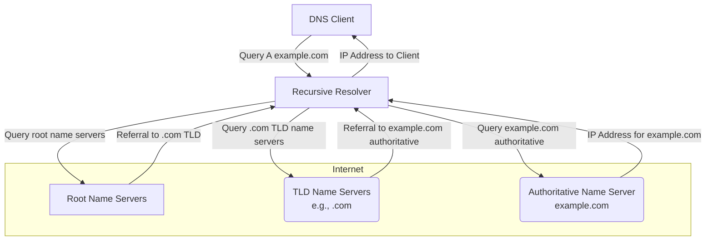

# Nostr-DNS

## Abstract

### Problem Description

Traditional DNS systems rely on hierarchical and centralized trust models, which
introduce single points of failure, censorship risks, and reliance on
certificate authorities. Efforts to decentralize DNS have emerged over time, but
many face usability or coordination challenges. A key missing element is a
reliable, censorship-resistant method for cryptographically proving domain
ownership without relying on centralized registrars.

### Proposed Solution

This project explores the development of a decentralized DNS service in which
ownership of subdomains is anchored in the Bitcoin blockchain, and DNS records
are stored as Nostr events on relays.

Domain ownership is established and proven through Bitcoin transactions, where
the possession of a particular UTXO corresponds to control over a given
subdomain. This model mirrors some of the mechanics behind NFTs, where a
spendable output acts as a transferable token of ownership.

DNS record metadata—such as IP addresses, TXT records, and service
declarations—is published using the Nostr protocol. The use of Nostr relays
allows DNS records to be widely distributed, tamper-resistant, and resilient to
censorship. Verification of domain record authenticity is made possible by
linking the signature of the Nostr events to the corresponding Bitcoin UTXO
holder.

### Potential Impact

DNS-Nostr presents a novel, user-controlled model for DNS that combines the
censorship resistance and immutability of Bitcoin with the real-time, flexible
publish-subscribe capabilities of Nostr. It offers an alternative naming and
resolution infrastructure for applications seeking trust minimization and
resilience. This project could serve as a foundation for decentralized websites,
identity systems, and service directories rooted in Bitcoin-native ownership
semantics.

## 1. What is my problem?

### 1.1 What is DNS?

Imagine the internet as a giant city. Every house (website) has a unique address
(IP address), a long string of numbers that can be difficult to remember and
even trickier to type. This is where the Domain Name System (DNS) comes in. It
acts like the phone book of this city, translating user-friendly domain names
(like "example.com" or "google.com") into those complex IP addresses that
computers understand. [^ref:cloudflare-what_is_dns]

This system is crucial because it allows us to navigate the internet using words
and phrases we can remember, instead of memorizing long strings of numbers.
Additionally, DNS offers another advantage when IP addresses can change over
time. By acting like an alias for computers providing services, DNS allows
updates in the link between the domain name and the service's IP address without
affecting how users access it. So, even if the "house" (server) moves locations
(changes its IP), users can still find it using the familiar domain name they've
always known. [^ref:cloudflare-what_is_dns]

The fundamental design goals of the DNS, as outlined in RFC 1034
[^ref:rfc_1034], emphasize consistency and broad utility. The primary aim was to
create a consistent naming space for referring to various resources, ensuring
that names themselves wouldn't be tied to specific network identifiers,
addresses, or routes. This design choice was crucial for allowing names to
remain stable even if the underlying network infrastructure changed.

Furthermore, the architects of DNS intended it to be generally useful and nots
limited to a single application. As RFC 1034 states, it should be possible to
use names to retrieve host addresses, mailbox data, and other as yet
undetermined information. This forward-thinking design ensures that any data
associated with a name is tagged with a specific type, allowing queries to be
precisely limited to the information desired. This highlights DNS's role not
just as an IP address lookup service, but as a flexible system capable of
associating diverse types of information with unique names on the internet.

Currently, the DNS promotes a top-down, hierarchical structure, starting from
the broadest level and progressively narrowing down to specific hosts. This
hierarchy begins with the DNS root zone, managed by the Internet Assigned
Numbers Authority (IANA) [^ref:iana-root_zone_management]. Below the root are
the top-level domain names (TLDs), encompassing generic categories like ".com",
".org", and ".net", as well as two-letter country codes from ISO-3166 (e.g.,
".fr", ".br", ".us") [^ref:iso_3166]. Each TLD is administered by a designated
entity, which then further delegates management of subdomains, effectively
forming a multi-level tree. These administrators play a crucial role in managing
portions of the naming tree, performing a public service on behalf of the
Internet community [^ref:rfc_1591].

### 1.2 How does DNS work?

As defined by RFC 1034 [^ref:rfc_1034], the DNS operates through a coordinated
effort of three major components: the domain name space and resource records,
name servers, and resolvers.

The domain name space forms a crucial part of this structure, serving as a
hierarchical, tree-structured system where each node or leaf conceptually names
a set of information. This space, along with its associated resource records,
defines the types of data that can be linked to a domain name. When a query is
initiated, it targets a specific domain name and requests a particular type of
resource information. For instance, the internet commonly uses domain names to
identify hosts, and queries for "address resources" (A records) will return the
corresponding IP addresses. This flexible design allows DNS to store various
kinds of information beyond just host addresses, such as mailbox data (MX
records) or descriptive text (TXT records), all tagged by their specific type,
allowing for precise queries.

Interacting with this name space are name servers, which are specialized
programs that maintain information about the domain tree's structure and its
associated data. While a name server can cache information from any part of the
domain tree, each typically holds complete and definitive information for a
specific subset of the domain space. For these particular portions of the name
space, a name server is considered an authority. This authoritative information
is organized into distinct units called zones, which can be automatically
distributed among multiple name servers to provide redundant service and ensure
data availability. Critically, name servers can also provide pointers to other
name servers, guiding a resolver toward the authoritative source for information
not held locally.

Finally, resolvers or recursive name servers act as the intermediaries between
user programs and name servers. These are typically system routines designed to
extract information from name servers in response to client requests. A
resolver's primary role is to access at least one name server and either
directly answer a query from its cached data or pursue the query by following
referrals to other name servers in the DNS hierarchy. This design means that
users interact with the DNS system indirectly through their local resolver,
abstracting away the complex process of traversing the name server network.

These three components roughly correspond to different perspectives within the
domain system. From a user's point of view, the DNS is a unified, accessible
tree, where information can be requested from any part via a simple call to a
local resolver. For the resolver, the system appears as a collection of
potentially many name servers, each holding a piece of the overall domain tree's
data, which the resolver treats as largely static databases. However, from the
perspective of a name server itself, the system consists of distinct, local
information sets called zones, which it must periodically update from master
copies while concurrently processing queries from resolvers.

When you type a domain name into your browser, a series of steps occur
leveraging these components:

1. Request Initiation: Your computer (the DNS Client) sends a query to a DNS
   resolver, often provided by your internet service provider (ISP).
   [^rfc:2132]
2. If the local DNS resolver does not have the requested information in its
   cache, it initiates a recursive query process on behalf of the DNS client. It
   begins this process by contacting one of the root name servers. These root
   servers are preconfigured with the IANA's "root hints file". This file
   contains the names and IP addresses of the authoritative name servers for the
   root zone.
3. TLD Name Servers: The resolver then queries the appropriate TLD name server,
   which directs it to the authoritative name servers for the specific domain
   (e.g., "example.com").
4. Authoritative Name Server: Finally, the resolver queries the authoritative
   name server for example.com, which holds the actual DNS records (like the IP
   address) for that domain.
5. Response and Caching: The IP address is returned to your resolver, then to
   your computer, and is often cached along the way for faster future lookups.

```mermaid
graph TD
    DnsClient[DNS Client] -->|Query A example.com| Recursive[Recursive Resolver];
    Recursive -->|Query root name servers| Root[Root Name Servers];
    Root -->|Referral to .com TLD| Recursive;
    Recursive -->|Query .com TLD name servers| D(TLD Name Servers <br> e.g., .com);
    D -->|Referral to example.com authoritative| Recursive;
    Recursive -->|Query example.com authoritative| E(Authoritative Name Server <br> example.com);
    E -->|IP Address for example.com| Recursive;
    Recursive -->|IP Address to Client| DnsClient;

    subgraph Internet
        Root
        D
        E
    end
```

Crucially, for a domain owner to make their website or service accessible, they
must publish their DNS records with their chosen DNS service provider (often a
registrar or a specialized DNS host). These providers typically store the zone
information, including all associated resource records (e.g., A, AAAA, CNAME,
MX, TXT records), in master files [^ref:rfc1035]. As defined in RFC 1035, these
master files are text files that contain RRs in a standardized text format,
serving as the primary means to define a zone's contents for a name server. Any
changes or updates to these records must be made through this provider, which
then propagates the updates to the global DNS system.

<!-- Centralized DNS -->

This hierarchical structure, while efficient, inherently centralizes control at various levels:

- Root Servers: Controlled by IANA and operated by a small number of organizations, making them a potential single point of failure or control.
- TLD Registries: Operators of TLDs can control vast swathes of the internet's naming.
- Domain Registrars: Companies like GoDaddy or Namecheap act as intermediaries for registering domain names, giving them power over domain ownership and transfer.
- DNS Service Providers: Services like Cloudflare or AWS Route 53 manage DNS records for many websites, consolidating significant control over resolution.
- This centralization leads to several critical issues:

- Censorship and Seizure: Governments or powerful entities can pressure or compel registrars and DNS providers to take down websites or alter DNS records. For example, countries may block access to social media platforms by compelling ISPs to alter DNS resolution for those domains [^ref:olhardigital-bloqueio_redes_sociais].
- Single Points of Failure: A major outage or attack on a centralized DNS provider can render vast portions of the internet unreachable.
- Trust in Third Parties: Users must trust registrars and DNS providers to honestly manage their domains and records, which may not always align with user interests.
- Lack of Immutability: DNS records are mutable and can be changed or revoked by the controlling authority, even against the will of the original domain owner.
- These problems highlight a fundamental need for a more resilient, censorship-resistant, and user-controlled naming system, particularly for applications where trust minimization and decentralized ownership are paramount.

<!-- Examples of the DNS centralized problem: Bloqueio x -->
<!-- https://olhardigital.com.br/2024/08/29/pro/como-e-feito-o-bloqueio-de-uma-rede-social-no-brasil/ -->

## 2. What is the solution to my problem?

<!-- What is Bitcoin? -->
<!-- What are the Bitcoin properties wanted? -->
<!-- What is Nostr? -->
<!-- What are the properties wanted from Nostr -->
<!-- BTC + Nost, How they fit together? -->

## 3. My solution solves the problem?
<!-- Does DNS becomes more uncensorable? -->
<!-- Problems with the solution -->
<!-- You still have to   -->

## References

[ref:cloudflare-what_is_dns]: [Cloudflare; What is DNS? | How DNS works](https://www.cloudflare.com/learning/dns/what-is-dns/)

[ref:cloudflare-1.1.1.1]: [Cloudflare; What is 1.1.1.1?](https://www.cloudflare.com/learning/dns/what-is-1.1.1.1/#:~:text=1.1.1.1%20is%20a%20public%20DNS%20resolver%20operated%20by%20Cloudflare,way%20to%20browse%20the%20Internet.)

[ref:aws-what_is_dns]: [AWS Route 53; What is DNS?](https://aws.amazon.com/route53/what-is-dns/)

[ref:iana-root_zone_management]: [IANA; Root Zone Management](https://www.iana.org/domains/root)

[ref:iana-root_files]: [IANA; Root Files](https://www.iana.org/domains/root/files)

[ref:iana-root_servers]: [IANA; Root Servers](https://www.iana.org/domains/root/servers)

[ref:dig]: [BIND 9 Administrator Reference Manual; dig - DNS lookup utility](https://downloads.isc.org/isc/bind9/cur/9.19/doc/arm/html/manpages.html#dig-dns-lookup-utility)

[ref:rfc_1034]: [DOMAIN NAMES - IMPLEMENTATION AND SPECIFICATION](https://www.ietf.org/rfc/rfc1034.txt)
[ref:rfc_1035]: [DOMAIN NAMES - IMPLEMENTATION AND SPECIFICATION](https://www.ietf.org/rfc/rfc1035.txt)
[ref:rfc_1591]: [Domain Name System Structure and Delegation](https://www.ietf.org/rfc/rfc1591.txt)
[ref:iso_3166]: [ISO 3166 - Códigos de país](https://www.iso.org/iso-3166-country-codes.html)
[ref:rfc_2132]: [DHCP Options and BOOTP Vendor Extensions](https://www.ietf.org/rfc/rfc2132.txt)

aiub -> 