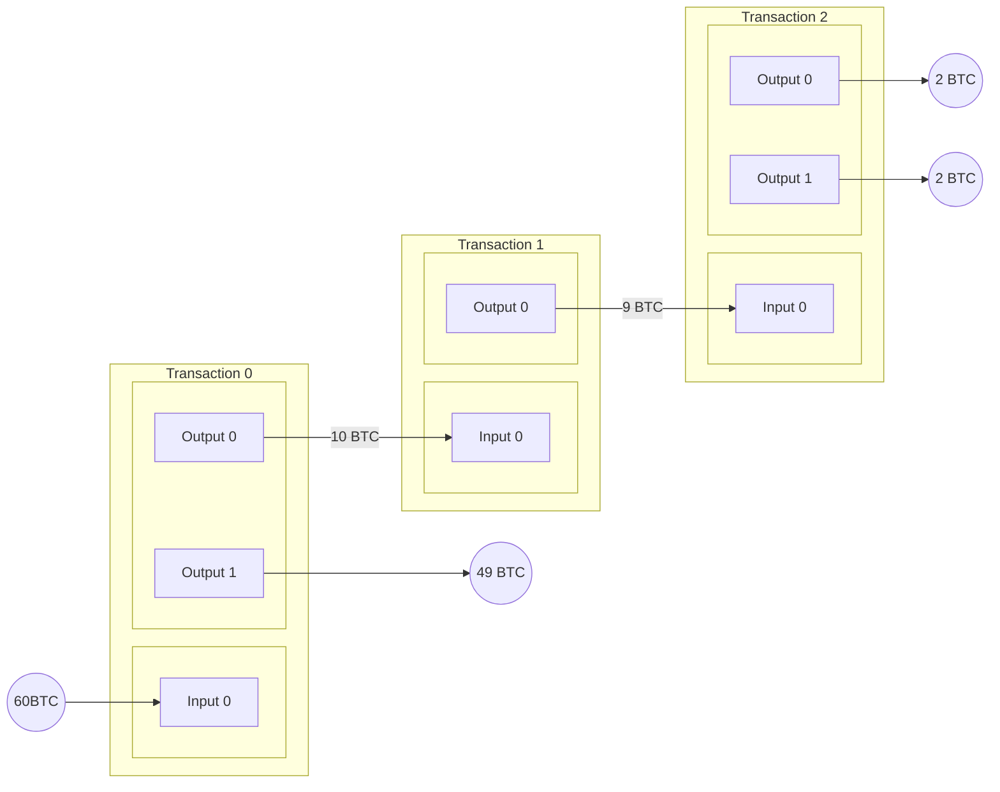

# Nostr-DNS

## Abstract

### Problem Description

Traditional DNS systems rely on hierarchical and centralized trust models,
introducing single points of failure, censorship risks, and reliance on
certificate authorities. Efforts to decentralize DNS have emerged over time, but
many face usability or coordination challenges. A key missing element is a
reliable, censorship-resistant method for cryptographically proving domain
ownership without relying on centralized registrars.

### Proposed Solution

This project explores the development of a decentralized DNS service in which
ownership of subdomains is anchored in the Bitcoin blockchain and DNS records
are stored as Nostr events on relays.

Domain ownership is established and proven through Bitcoin transactions, where
the possession of a particular UTXO corresponds to control over a given
subdomain. This model mirrors some of the mechanics behind NFTs, where a
spendable output acts as a transferable token of ownership.

DNS record metadata—such as IP addresses, TXT records, and service declarations
is published using the Nostr protocol. Using Nostr relays allows DNS records to
be widely distributed, tamper-resistant, and resilient to censorship.
Verification of domain record authenticity is made possible by linking the
signature of the Nostr events to the corresponding Bitcoin UTXO holder.

### Potential Impact

DNS-Nostr presents a novel, user-controlled model for DNS that combines the
censorship resistance and immutability of Bitcoin with the real-time, flexible
publish-subscribe capabilities of Nostr. It offers an alternative naming and
resolution infrastructure for applications seeking trust minimization and
resilience. This project could be a foundation for decentralized websites,
identity systems, and service directories rooted in Bitcoin-native ownership
semantics.

## 1. What is my problem?

### 1.1 What is DNS?

Imagine the internet as a giant city. Every house (website) has a unique address
(IP address), a long string of numbers that can be difficult to remember and
even trickier to type. This is where the Domain Name System (DNS) comes in. It
acts like the phone book of this city, translating user-friendly domain names
(like "example.com" or "google.com") into those complex IP addresses that
computers understand.[^cloudflare-what_is_dns]

This system is crucial because it allows us to navigate the internet using words
and phrases we can remember instead of memorizing long strings of numbers.
Additionally, DNS offers another advantage when IP addresses can change over
time. By acting like an alias for computers providing services, DNS allows
updates in the link between the domain name and the service's IP address without
affecting how users access it. So, even if the "house" (server) moves locations
(changes its IP), users can still find it using the familiar domain name they've
always known.[^cloudflare-what_is_dns]

The fundamental design goals of the DNS, as outlined in RFC 1034[^rfc_1034],
emphasize consistency and broad utility. The primary aim was to create a
consistent naming space for referring to various resources, ensuring that names
wouldn't be tied to specific network identifiers, addresses, or routes. This
design choice allowed names to remain stable even if the underlying network
infrastructure changed.

Furthermore, the architects of DNS intended it to be generally helpful and not
limited to a single application. As RFC 1034 states, using names to retrieve
host addresses, mailbox data, and other undetermined information should be
possible. This forward-thinking design ensures that any data associated with a
name is tagged with a specific type, allowing queries to be precisely limited to
the information desired. This highlights DNS's role not just as an IP address
lookup service but as a flexible system capable of associating diverse types of
information with unique names on the internet.

Currently, the DNS is a hierarchical system of databases with a top-down,
hierarchical structure, starting from the broadest level and progressively
narrowing down to specific hosts. This hierarchy begins with the DNS root zone,
managed by the Internet Assigned Numbers Authority
(IANA)[^iana-root_zone_management]. Below the root are the top-level domain
names (TLDs), encompassing generic categories like ".com", ".org", and ".net",
as well as two-letter country codes from ISO-3166 (e.g., ".fr", ".br",
".us")[^iso_3166]. Each TLD is administered by a designated entity, which then
further delegates management of subdomains, effectively forming a multi-level
tree. These administrators play a crucial role in managing portions of the
naming tree, performing a public service on behalf of the Internet
community[^rfc_1591].


### 1.2 How does DNS work?

As defined by RFC 1034 [^rfc_1034], the DNS system comprises three major
elements: the Domain Name Space and Resource Records, Name Servers, and
Resolvers. These elements collectively establish and manage a consistent naming
space for referring to various resources, allowing for the retrieval of
associated information without names being rigidly tied to a specific network
identifiers or addresses.

The domain name space forms a crucial part of this structure, serving as a
hierarchical, tree-structured system where each node or leaf conceptually names
a set of information. This space and its associated resource records define the
types of data that can be linked to a domain name. When a query is initiated, it
targets a specific domain name and requests a particular type of resource
information. For instance, the internet commonly uses domain names to identify
hosts and queries for "address resources" (A records) will return the
corresponding IP addresses. This flexible design allows DNS to store various
kinds of information beyond host addresses, such as mailbox data (MX records) or
descriptive text (TXT records), all tagged by their specific type, allowing for
precise queries.

Name servers interact with this namespace, which are specialized programs that
maintain information about the domain tree's structure and associated data.
While a name server can cache information from any part of the domain tree, each
typically holds complete and definitive information for a specific subset of the
domain space. A name server is considered an authority for these particular
namespace portions. This authoritative information is organized into distinct
units called zones, which can be automatically distributed among multiple name
servers to provide redundant service and ensure data availability. Critically,
name servers can also give pointers to other name servers, guiding a resolver
toward the authoritative source for information not held locally.

Finally, resolvers act as the intermediaries between user programs and name
servers. These are typically system routines designed to extract information
from name servers in response to client requests. A resolver's primary role is
to access at least one name server and directly answer a query from its cached
data or pursue it by following referrals to other name servers in the DNS
hierarchy. This design means that users interact with the DNS system indirectly
through their local resolver, abstracting away the complex process of traversing
the name server network.

These three components correspond to different perspectives within the
domain system. From a user's point of view, the DNS is a unified, accessible
tree where information can be requested from any part via a simple call to a
local resolver. For the resolver, the system appears as a collection of
potentially many name servers, each holding a piece of the overall domain tree's
data, which the resolver treats as largely static databases. However, from the
perspective of a name server itself, the system consists of distinct, local
information sets called zones, which it must periodically update from master
copies while concurrently processing queries from resolvers.

When you type a domain name into your browser, a series of steps occur
leveraging these components:

1. Request Initiation: Your computer, as DNS client sends a query to a DNS
   resolver, often provided by your internet service provider (ISP).
   [^rfc_2132]
2. If the local DNS resolver does not have the requested information in its
   cache, it initiates a recursive query process on behalf of the DNS client. It
   begins this process by contacting one of the root name servers. The recursive
   resolver is preconfigured with the IANA's "root hints file", which contains
   the names and IP addresses of the authoritative name servers for the root
   zone.
3. TLD Name Servers: The resolver then queries the appropriate TLD name server,
   which directs it to the authoritative name servers for the specific domain
   (e.g., "example.com").
4. Authoritative Name Server: Finally, the resolver queries the authoritative
   name server, which holds the actual DNS records (like the IP address) for
   that domain.
5. Response and Caching: The answer is returned to your resolver, then to your
   computer, and is often cached along the way for faster future lookups.


Crucially, for a domain owner to make their website or service accessible, they
must publish their DNS records with their chosen DNS service provider (often a
registrar or a specialized DNS host). These providers typically store the zone
information, including all associated resource records (e.g., A, AAAA, CNAME,
MX, TXT records), in master files[^rfc_1035]. As defined in RFC 1035, these
master files are text files that contain RRs in a standardized text format,
serving as the primary means to define a zone's contents for a name server. The
owner must make any changes or updates to these records through this provider,
which then propagates the updates to the global DNS system.

To illustrate the structure of a typical DNS master file, consider the following
example for <example.com>:

```dns
; Start of Authority (SOA) Record: Defines the primary name server and administrative details for the zone.
@       IN  SOA (
                    ns.icann.org.       ; Primary name server
                    noc.dns.icann.org.  ; E-mail of the administrator is noc@dns.icann.org.
                    2025011653          ; Serial number (typically YYYYMMDDNN)
                    7200                ; Refresh (seconds)
                    3600                ; Retry (seconds)
                    1209600             ; Expire (seconds)
                    3600                ; Minimum TTL (seconds)
                )

; Address (A) Records: Maps a domain name to an IPv4 address.
@       IN A     23.192.228.84  ; example.com maps to this IP address
www     IN A     201.30.129.137 ; www.example.com maps to this IP address
mail    IN A     96.7.128.198   ; mail.example.com maps to this IP address

; IPv6 Address (AAAA) Records: Maps a domain name to an IPv6 address.
@       IN  AAAA    2600:1408:ec00:36::1736:7f24
www     IN  AAAA    2600:1406:3a00:21::173e:2e65

; Mail Exchanger (MX) Records: Specifies mail servers for the domain.
; The number (e.g., 10) is the preference value; lower numbers are preferred.
@       IN  MX      10  mail ; example.com uses mail.example.com as its mail server

; Canonical Name (CNAME) Record: Creates an alias from one domain name to another.
ftp     IN  CNAME   example.com. ; ftp.example.com is an alias for example.com

; Text (TXT) Records: Stores arbitrary text data, often used for verification or policy.
@       IN  TXT     "_k2n1y4vw3qtb4skdx9e7dxt97qrmmq9"
@       IN  TXT     "v=spf1 -all"
_dmarc  IN  TXT     "v=DMARC1;p=reject;sp=reject;adkim=s;aspf=s"; DMARC policy
```

### 1.3 Problems with DNS

While the Domain Name System (DNS) is foundational to the internet's global
functionality, its inherent centralized control points, particularly at the root
At this level, it introduces significant political vulnerabilities and risks.
The Internet Assigned Numbers Authority (IANA), operating under the Internet
Corporation for Assigned Names and Numbers (ICANN) manages the DNS root zone.
Although this centralized coordination is broadly deemed indispensable for
global internet stability and interoperability, ensuring consistent unique
identifiers worldwide[^iana-about], it simultaneously creates a crucial point of
leverage for political influence.

The primary concern is that IANA's functions represent a single point of failure
(SPOF) not necessarily in terms of technical resilience against physical
attacks, but critically at the policy and data management
layers[^old_dominion-brief_review_of_dns]. This centralized control over the
authoritative root zone file—which dictates the internet's top-level
structure—exposes the entire system to political pressure, manipulation, and
censorship. Such vulnerabilities fundamentally undermine the internet's core
principles of openness and neutrality, contributing to the increasing threat of
Internet fragmentation, often termed the "Splinternet," which jeopardizes global
interoperability and communication[^european_union-internet_governance]. The
historical role of the U.S. government and ongoing concerns about its influence
over ICANN, despite the multi-stakeholder model, further highlight that control
in Internet governance is a complex sociotechnical and political issue,
extending beyond mere technical operations.

A direct manifestation of this political vulnerability is DNS-based blocking and
manipulation, a prevalent method of internet censorship. This process interferes
with DNS resolution, the initial step in accessing online resources. Authorities
can compel Internet Service Providers (ISPs) to configure their DNS servers to
prevent access to specific websites—either by failing to return an IP address,
redirecting users to government-approved pages, or even to deceptive fake
versions of the site [^tatua-what_is_censorship]. ISPs' ability to mandate
the use of their designated DNS servers for customer devices provides them with
a powerful mechanism for control and censorship.

Real-world incidents vividly illustrate how these centralized control points
enable political and state-level interference. For instance, in November 2021,
users in Mexico received bogus DNS responses for <whatsapp.net>. This was caused
by a BGP (Border Gateway Protocol) route leak, where a network inadvertently or
intentionally advertised incorrect routing information. This misdirection
diverted DNS queries to a local instance of a root name server located in China.
These rerouted queries then passed through middleboxes—network devices that can
inspect and alter traffic—which injected fake DNS
responses[^delft_university-intercept_and_inject]. Similar incidents of BGP
route leaks leading to DNS manipulation by state-controlled infrastructure in
China were reported in 2010 and 2011, affecting domains like <twitter.com> and
<facebook.com>[^delft_university-intercept_and_inject]. More recently, in In
August 2024, Brazil's Supreme Court imposed a ban on X (formerly Twitter),
compelling ISPs to block access by configuring their DNS systems to withhold the
platform's IP addresses [^reason_foundation-x_ban]
[^olhar_digital-como_e_feito_o_bloqueio].

Beyond direct censorship, the current DNS system also suffers from a significant
lack of transparency and accountability. Decisions regarding domain
registrations, updates, and resolutions are frequently made within the opaque
confines of domain registrars and governing bodies, offering end-users limited
insight into these processes. This opacity further underscores the systemic
weaknesses in the DNS ecosystem's security, resilience, and trustworthiness.

These examples underscore that despite its technical distribution, the DNS's
centralized governance and operational choke points pose significant threats to
Internet freedom, accessibility, and neutrality, highlighting an urgent need for
more resilient and decentralized naming solutions.

## 2. What is the solution to my problem?

To address the inherent vulnerabilities and centralized control points of the
traditional Domain Name System (DNS), blockchain-based naming systems (BDNS)
offer a paradigm shift. This approach leverages blockchain technology to
architect a more resilient, secure, and censorship-resistant internet naming
infrastructure, liberating the system from its reliance on central authorities
like ICANN, domain registries, and registrars [^afnic-blockchain_replace_dns].

The core tenets of blockchain—decentralization, immutability, and cryptographic
security—directly counteract the weaknesses of the current DNS. By recording and
replicating information across a distributed network of nodes, a BDNS eliminates
the single points of failure that make the traditional system susceptible to
technical outages and political pressure [^southampton-blockchain_based_dns].
This distributed architecture not only enhances resilience against attacks like
Distributed Denial of Service (DDoS) it also renders the data exceptionally
difficult to falsify [^afnic-blockchain_replace_dns]. Consequently, it becomes
nearly impossible for any single entity to block, seize, or censor a domain name
through administrative or legal coercion—a direct countermeasure to the
censorship mechanisms prevalent today [^afnic-blockchain_replace_dns].

Furthermore, using an immutable public ledger enhances the security and
transparency of the entire domain management lifecycle. Every registration and
modification is recorded as a cryptographically secured transaction, creating a
tamper-proof and auditable ownership history. BDNS allows network participants
to independently validate domain ownership and data integrity without trusting a
central intermediary [^southampton-blockchain_based_dns].

This unique, verifiable, and user-controlled digital ownership model finds a
natural and robust technical implementation in Non-Fungible Tokens (NFTs). An
NFT is a unique cryptographic token on a blockchain that represents ownership of
a specific asset, such as a domain name [^open_sea-what_are_nft_domain_names].
The "non-fungible" property is critical; just as every domain name (e.g.,
example.com) is unique, each NFT is distinct and cannot be interchanged on a
one-to-one basis, making them ideally suited to represent exclusive domain
ownership [^open_sea-what_is_nft?]. This model transforms domain ownership from
a temporary lease, contingent on periodic renewals with a registrar, into a
persistent digital asset fully controlled by the user. This shift to actual
ownership is a foundational principle of the proposed solution
[^open_sea-what_are_nft_domain_names].

While numerous blockchains can support NFTs, Bitcoin presents a particularly
compelling foundation for a global naming system. Launched in 2009 by Satoshi
Nakamoto, Bitcoin's defining feature is its unparalleled security, which is a
direct function of its Proof of Work (PoW) consensus mechanism
[^satoshi-nakamoto_bitcoin]. The immense and continuously accumulating
computational work required to validate transactions makes the Bitcoin's
blockchain extraordinarily resistant to attack and manipulation, providing the
robust foundation of trust necessary for critical infrastructure like DNS
[^van_eck-bitcoin_vs_ethereum].

Moreover, Bitcoin's long-standing market dominance and vast network effect
signal its stability and long-term viability, crucial attributes for a service
intended to be permanent and globally accessible
[^coinmarketcap-bitcoin_dominance]. By leveraging Bitcoin's native security,
this project proposes a system where domain ownership is anchored directly
on-chain. The following sections will detail how specific protocols built upon
Bitcoin can enable the inscription of these domain NFTs, establishing ownership
with an unprecedented level of immutability and censorship resistance, thereby
forming the core of the DNS-Nostr architecture.

### 2.1 How Bitcoin Works?

To understand how domain ownership can be anchored in Bitcoin, one must first
grasp its fundamental architecture, which differs significantly from modern
blockchains. The primary distinction lies in Bitcoin's intentionally limited
scripting capabilities. Unlike Ethereum, Bitcoin does not feature
Turing-complete smart contracts. A Turing-complete system can, with enough
resources, compute anything computable, allowing developers to write code for
virtually any arbitrary state transition function [^vitalik_buterin-etherium].
On Ethereum, this enables complex, stateful "smart contracts" to manage an
entire collection of NFTs—dictating their properties, minting rules, and
ownership transfers within a sophisticated program. On the other hand,
developers must creatively combine their simpler base components to create a
similar system on Bitcoin.

We will explore this from the top down: first, the overall structure of the
blockchain ledger; second, the UTXO set that represents ownership; third, the
transactions that update this state, and finally, the Script language that
enforces the ownership rules.

#### 2.1.1 The Blockchain Ledger and Proof of Work

The Bitcoin blockchain is a public, ordered, back-linked list of transaction
blocks. It is often visualized as a vertical stack, where each new block is
placed on top of the previous one, creating a chain that extends back to the
first block, the Genesis block. This structure gives rise to terms like
"height," which refers to a block's position in the chain relative to the
genesis block.

The integrity and immutability of this chain are secured through cryptography.
Each block contains a header with critical metadata, including a timestamp, a
single cryptographic hash (known as the Merkle root) that serves as a compact
summary of all transactions within that block, and, most importantly, a
cryptographic hash of the previous block's header. This "previous block hash"
acts as a pointer, linking each block to its parent. This hash is also a key
input for calculating the current block's hash. As a result, any alteration to a
historical block would change its hash, invalidating the "previous block hash"
pointer in the subsequent block, causing a cascading invalidation to the tip of
the chain.

The diagram below illustrates this structure, showing how Block 2 contains a
hash pointing to Block 1, which in turn points to Block 0, forming an
cryptographic chain.


This chain reaction makes the blockchain's history so difficult to change. To
successfully alter a past block, an attacker must redo the work for that block
and all subsequent blocks. Bitcoin's consensus mechanism, Proof of Work (PoW)
makes this computationally and economically impractical. To produce a new valid
block, network participants known as "miners" select a set of unconfirmed
transactions and compete to find a valid hash for the new block's header that
meets a specific difficulty target. This process involves repeatedly hashing the
block header with a different random value (called a nonce) until a valid
solution is found. The network automatically adjusts this difficulty target
approximately every two weeks to ensure that, on average, a new block is added
to the chain roughly every 10 minutes.

The existence of a long chain of blocks, each secured by this intensive work,
proves that the history of transactions is authentic and cannot be changed
without re-expending an infeasible amount of energy. Miners receive a reward to
incentivize this computationally expensive work. The first transaction in any
block is a special coinbase transaction, created by the miner, which serves two
purposes: it mints entirely new bitcoins (the "block subsidy") and collects the
fees from all other transactions included in the block. The block subsidy is a
fixed amount that diminishes over time, halving approximately every four years
(or 210,000 blocks) to control the currency's supply, ensuring a maximum of 21
million bitcoins will ever exist.

This system creates a market for block space. Each Bitcoin block is limited in
the amount of data it can contain, currently capped at 4 million weight units (a
modern measurement that replaced the simple byte count). Because space in each
new block is scarce, users who want to ensure their transactions are confirmed
quickly must include a transaction fee. Economically rational miners will
prioritize transactions with higher fees to maximize their reward from the
coinbase transaction. This creates a competitive fee market where users
effectively bid to have their transactions included in the next block, forming a
crucial part of Bitcoin's economic security model that will sustain the network
even after the block subsidy eventually ends.

#### 2.1.2 State and Transactions

In Bitcoin, the current state of the blockchain is represented by the Unspent
Transaction Output (UTXO) set. A UTXO is a bitcoin amount locked to a specific
owner with the power to spend it. Think of the UTXO set as a global, public
ledger of all spendable bitcoin chunks currently in existence. Possessing a
particular UTXO, usually locked by a private key, constitutes ownership in the
Bitcoin network[^andreas_antonopoulos-mastering_bitcoin].

To transfer ownership of bitcoins in the network, users create transactions,
which are signed data structures that act as a request to update the UTXO set.
In simple terms, a transaction does two things:

1. It consumes one or more existing UTXOs as inputs. These are the funds being
   spent. Once consumed, these UTXOs are removed from the global UTXO set, as
   they are no longer "unspent".
2. It creates one or more new UTXOs as outputs. These new UTXOs represent the
   transferred value that is now locked to new owners and are added to the
   global UTXO set.

The following diagram illustrates a single transaction. It consumes two existing
UTXOs (worth 5 BTC and 3 BTC) for a total input value of 8 BTC. It then creates
two new UTXOs as outputs: one for 6 BTC and another for 1 BTC. The total output
value is 7 BTC. The 1 BTC difference between the inputs and outputs is not lost;
The miner who includes this transaction in a block can claim the transaction
fee.


This process forms a continuous "transaction chain," where the outputs of one
transaction become the potential inputs for a future transaction. Each
transaction must contain a digital signature that proves ownership of the inputs
being spent, which any node on the network can independently
validate[^andreas_antonopoulos-mastering_bitcoin]. The diagram below shows this
chain of dependency: an initial 60 BTC UTXO is spent in Transaction 0, which
creates two new outputs. The first output (10 BTC) is later consumed as the
input for Transaction 1, creating a 9 BTC output that becomes the input for
Transaction 2. This demonstrates how value flows from one transaction to the
next over time.



A transaction is only considered final once it has been included in a valid
block and added to the blockchain. This is known as transaction confirmation.
Their position in the blockchain strictly determines the order in which
transactions officially affect the ledger. This order is defined first by the
height of the block they are in, and then by their specific index (their
position) within that block. This ensures that every node in the network
processes the history of state changes in the same sequence.

The transaction fee is a crucial element for getting a transaction confirmed. It
is calculated implicitly as the sum of a transaction's inputs minus the sum of
its outputs. Miners are incentivized to maximize their profit, so they
prioritize transactions that offer a higher fee relative to their size. This
means users must be mindful of their transaction's size, as a larger transaction
generally requires a higher total fee to be competitive. The primary factors
affecting transaction size are the number of inputs (which typically contribute
the most), the number of outputs, and the complexity of the Script code within
them.

As can be seen, every UTXO has a permanent and unique position on the blockchain
that allows it to be precisely identified. This position is defined by the
combination of the transaction ID (*txid*) of the transaction that created it
and its output index within that transaction's list of outputs (often denoted as
vout, starting from 0). This (*txid*, *vout*) pair is a unique pointer to a
specific spendable output in the entire blockchain history. Alternatively, once
a transaction is confirmed, its UTXOs can also be located by their physical
position in the ledger: their block height (*blockheight*), their index within
that block (*blockindex*), and their specific output index, forming the triplet
(*blockheight*, *blockindex*, *vout*).

#### 2.1.3 Bitcoin Script: Enforcing Ownership Rules

The "lock" on a UTXO is a small program written in Bitcoin's Script language.
Every UTXO has a locking script (technically known as scriptPubKey) that defines
the conditions required to spend it. To spend that UTXO, a new transaction must
provide a corresponding unlocking script (or scriptSig) in its input that
satisfies these conditions.

Bitcoin's scripting language, `Script`, is purposefully non-Turing-complete. It
lacks loops and complex state-handling capabilities, making it more predictable,
secure, and less prone to complex bugs. Consequently, creating an NFT-like
system on Bitcoin is more challenging. Deploying a single, all-encompassing
contract to manage a domain registry is impossible. Instead, the desired
functionality must be built by combining Bitcoin's simpler base
components—transactions and UTXOs—in clever ways to represent the state and
ownership of unique digital assets.

The Bitcoin Script is a stack-based language. Operations are executed
sequentially, pushing data onto and popping data off a data structure called a
stack. A typical legacy script known as "Pay-to-Public-Key-Hash" (P2PKH) locks a
UTXO to the hash of a public key. The locking script looks like this:

```bash
OP_DUP
OP_HASH160
OP_PUSH $PUBLIC_KEY_HASH
OP_EQUALVERIFY
OP_CHECKSIG
```

To spend this UTXO, the owner must provide an unlocking script containing their
full public key and a valid digital signature for the transaction. A
corresponding unlocking script might look like this:

```bash
OP_PUSH $SIGNATURE
OP_PUSH $PUBLIC_KEY
```

To validate the transaction, the Bitcoin network executes the unlocking script
followed immediately by the locking script. The process is valid if, at the end
of the execution, the top item on the stack is TRUE (represented by any "truthy"
value, i.e., any nonzero and non-empty value).

Let's walk through the P2PKH validation step-by-step:

1. **Initial State:** The process begins with an empty stack.
2. **Execute Unlocking Script:** First, the items from the unlocking script are
   pushed onto the stack. The `SIGNATURE` is pushed, followed by the
   `PUBLIC_KEY`.
3. **Execute Locking Script:** Now, the opcodes from the locking script are
   executed one by one:
   - **OP_DUP:** Duplicates the top item on the stack (the `PUBLIC_KEY`).
   - **OP_HASH160:** Pops the top item (`PUBLIC_KEY`), hashes it, and pushes the
     resulting `RESULT_PUBLIC_KEY_HASH` back onto the stack.
   - **Push `PUBLIC_KEY_HASH`**: The public key hash specified in the original
     locking script is pushed onto the stack for comparison.
   - **OP_EQUALVERIFY:** Pops the top two items (the two public key hashes) and
     compares them. If they are not equal, the script fails immediately. If they
     are equal, they are simply removed, and execution continues. This verifies
     that the provided public key matches the one required by the lock.
   - **OP_CHECKSIG:** Pops the final two items (`PUBLIC_KEY` and `SIGANTURE`).
     It verifies that the signature is valid for this transaction using the
     provided public key. If it is valid, it pushes TRUE onto the stack.

This entire security model is built upon the foundation of asymmetric
cryptography. The `OP_CHECKSIG` opcode is the crucial step in enforcing this
principle. It uses the properties of digital signatures for authentication. When
the script runs, `OP_CHECKSIG` takes the public key and the digital signature
and mathematically verifies that the signature could only have been created by
the owner of the corresponding private key for this specific transaction. This
process proves that the spender is the legitimate owner of the UTXO without
their private key ever being exposed on the network, thus securely authorizing
the transfer of value. The deterministic and straightforward nature of Script
ensures that every node on the network can independently and reliably come to
the same conclusion about a transaction's validity.

### 2.2 Name-Token Protocol

One of the primary challenges of tokenizing assets on Bitcoin is establishing a
stable identifier. Bitcoin's architecture is based on Unspent Transaction
Outputs (UTXOs), which are consumed and destroyed every time they are spent.
This transient nature makes creating a persistent digital token that can be
reliably tracked, updated, and revoked without a specialized protocol
challenging.

To solve this, this project introduces Name-Token, a novel protocol designed to
manage unique names and associate them with arbitrary data directly on the
Bitcoin blockchain. The protocol treats each unique name as a distinct digital
asset, represented by a single UTXO. The ownership and history of these
Name-Tokens are immutably recorded, providing the stable, verifiable identifier
that is otherwise difficult to achieve.

A concise set of principles governs the creation, management, and validity of
name tokens. These rules ensure uniqueness and create a predictable lifecycle
for each named asset by leveraging the inherent structure of Bitcoin
transactions.

1. **Unique Representation:** Each unique Name-Token is represented by a single,
   distinct Unspent Transaction Output (UTXO), which embodies the token's
   existence and state.
2. **Inscribed Metadata:** The blockchain permanently inscribes all relevant
   data for a Name Token, including its label and associated parameters.
3. **State Verification via UTXO Scan:** The current set of all valid
   Name-Tokens is determined by scanning the Bitcoin UTXO set for outputs that
   conform to the protocol's specified inscription format.
4. **First-is-Root Uniqueness:** Only one Name-Token can be valid at a time for
   any given label. The "First-is-Root" rule dictates that a label's
   chronologically first-minted (earliest confirmed) token is the only valid
   one. Any subsequent attempt to mint a token with the same label is invalid
   unless all older, valid tokens with that label have first been revoked.
5. **Continuity via Same-Index Chain:** The history and continuity of a
   Name-Tokens are maintained across transactions via a positional link. To
   update a token, its UTXO must be spent as an input, and a new UTXO with an
   updated inscription must be created in the output of the same transaction and
   at the same index.

To fully define the protocol, it's essential to elaborate on each core
principle's technical specifications and implications. The following subsections
detail how each rule is implemented and how they work together to create a
robust system for managing names on the Bitcoin blockchain.

#### 2.2.1 Unique Representation

The fundamental design choice of the Name-Token protocol is to embody the
token's entire existence and state within a single, distinct Unspent Transaction
Output (UTXO). This approach ensures that each name is uniquely identifiable and
can be independently updated, transferred, or revoked without ambiguity. This
makes ownership unequivocal: controlling the private key that can spend the UTXO
constitutes control over the Name-Token. This UTXO serves as the definitive,
on-chain proof of ownership and the current state of the name.

#### 2.2.2 Inscribed Metadata

For a Name-Token to be truly functional, it must carry relevant data. Bitcoin's
blockchain has a long history of being utilized beyond simple payments, with
early innovators embedding data within transaction outputs to harness the
network's unparalleled security for diverse applications like digital notary
services.

While various methods have emerged, a common approach for embedding data
involves an OP_RETURN output. This opcode creates a provably unspendable output
designed solely to hold arbitrary data. However, the Name-Token protocol employs
a more sophisticated "envelope" technique, leveraging `OP_FALSE`, `OP_IF`, and
`OP_ENDIF` opcodes. This specific structure enables the inscription of metadata
directly into the locking script of a standard, spendable transaction output.
The critical innovation here is that the enclosed opcodes are never executed
because the data is encapsulated within an `OP_IF` block preceded by `OP_FALSE`.
Standard Bitcoin nodes, therefore, treat the script as valid but ignore its
encapsulated content, maintaining full compatibility with the network.
Conversely, Name-Token-aware software can readily parse and interpret this
embedded data.

This ingenious envelope effectively splits the locking script into two
conceptual parts:

1. **Name-Token Envelope:** This is the `OP_FALSE OP_IF...OP_ENDIF` segment that
   contains the inscribed metadata.

2. **Non-Dead-Code Locking Script:** This is the standard Bitcoin script that
   follows the OP_ENDIF and defines the actual spending conditions for the UTXO.
   For instance, it could be a simple Pay-to-Public-Key-Hash (P2PKH) script
   requiring a signature from the owner's private key. The presence of the
   Name-Token inscription does not prevent the UTXO from being spent; it merely
   adds metadata.

The general structure of the Name-Token inscription within the locking script is
as follows:

```bash
OP_FALSE
OP_IF
  OP_PUSH "name"            # Indicates that this inscription is from Name-Token protocol
  OP_PUSH $label            # The token's label (e.g., "blog")
  OP_NOP                    # Section separator
  OP_PUSH $section_protocol # Identifier for the protocol using this token's data (e.g., "dns-nostr")
  OP_PUSH $argument_0       # Protocol-specific argument (format depends on <section_protocol>)
  # ...
  # Additional protocol-specific sections can be added, each preceded by OP_NOP
OP_ENDIF
```

The general structure of the Name-Token inscription is as follows:

```bash
OP_FALSE
OP_IF
  OP_PUSH "name"            # Namespace identifier (byte string)
  OP_PUSH $label            # Represents the subdomain (e.g., "blog")
  OP_NOP                    # Section separator
  OP_PUSH $section_protocol # Identifier for the protocol using this token's data (e.g., "dns-nostr")
  OP_PUSH $argument_0       # Protocol-specific argument (format depends on <section_protocol>)
  # ...
  # Additional protocol-specific sections can be added, each preceded by OP_NOP
OP_ENDIF
# [Non-dead-code locking script follows here, e.g., P2PKH script for spending]
```

Each line within the `OP_FALSE OP_IF ... OP_ENDIF` block serves a specific
purpose, designed for extensibility and multi-protocol support. The initial
`OP_PUSH` "name" acts as a magic number or protocol identifier, signaling that
the subsequent data should be interpreted according to the Name-Token
specification. The `$label` defines the specific name of the Name-Token,
providing the actual naming component. The `OP_NOP` is a crucial separator,
allowing the protocol to delineate distinct metadata sections. This separation
is particularly powerful for accommodating multiple protocols; the
`$section_protocol` identifier, followed by its `$argument_0` and potentially
more arguments, specifies how different applications built on top of Name-Tokens
should interpret the following data. This modular design ensures that the same
underlying Name-Token UTXO can carry different types of metadata, relevant to
various decentralized applications, without breaking compatibility.

For a Name-Token UTXO with this inscription to be spent, an unlocking script
must be provided that satisfies the non-dead-code locking script portion that
follows the `OP_ENDIF`.

For example, if the non-dead-code locking script is a standard P2PKH script
(requiring a public key and a signature), an input unlocking script for a
transaction spending this Name-Token UTXO would look like this:

```bash
OP_PUSH $SIGNATURE          # The digital signature for the transaction
OP_PUSH $PUBLIC_KEY         # The public key corresponding to the private key that controls the UTXO
```

#### 2.2.3 State Verification via UTXO Scan

The complete, current state of all Name-Tokens can be derived directly from
Bitcoin's live UTXO set. This is a powerful feature, as it means the protocol's
state is part of Bitcoin's own state, simplifying the search for Name-Tokens in
the blockchain. An application finds the data associated with a name simply by
finding its corresponding UTXO.

It is critical to note that not all UTXOs are Name-Tokens. To identify a
Name-Token, a client or indexer must scan the UTXO set and filter for only those
outputs whose locking scripts contain a valid inscription that conforms to the
protocol's `OP_FALSE OP_IF... OP_ENDIF` structure. The protocol ignores any UTXO
that does not match this format.

#### 2.2.4 First-is-Root Uniqueness

This principle dictates that while multiple Name-Tokens for a given label may
exist, only one can be considered the valid, authoritative token at any given
time. The valid token is unequivocally the one that was minted at the earliest
chronological time, meaning it was confirmed at the lowest (earliest) block
height. For instance, if Alice mints a Name-Token for "blog" in block 800,000,
and Bob subsequently attempts to mint a Name-Token for "blog" in block 800,100,
only Alice's token is recognized as valid. Despite being on the blockchain,
Bob's token is considered an invalid mint attempt under this rule.

Crucially, the "First-is-Root" rule introduces a notion of age or seniority to
Name-Tokens. Older, earlier-minted tokens take precedence over newer ones. Bob's
otherwise invalid "blog" token could only become valid if Alice's token and any
other "blog" tokens minted between block 800,000 and 800,100 were first
explicitly revoked or spent. This ensures a clear, unambiguous, and unforgeable
ownership hierarchy, leveraging the Bitcoin blockchain's immutable timestamping
and ordered nature to establish global uniqueness for each Name-Token label.

#### 2.2.5 Continuity via Same-Index Chain

The Name-Token protocol ensures each token's stable and auditable history by
enforcing a "same-index chain" or "input/output chain" rule. This mechanism
creates a robust positional link between an input and its corresponding output
within a transaction, allowing the token's lifecycle to be transparently tracked
across the Bitcoin blockchain.

With these principles, the current UTXO must be used as input in a new
transaction to update a token's data or transfer ownership. A new UTXO
containing the updated inscription must be created in an output at the same
index. For example, if a token's UTXO is spent as the second input (input[1]),
the updated token must be inscribed in the second output (output[1]). This
same-index rule is the stable identifier that links a token's state across
multiple transactions. A transfer is simply an update where the new output is
locked to a new owner's key.

This principle strongly correlates with the fundamental concept of the Bitcoin
transaction chain, where the output of one transaction becomes the input of a
subsequent one. The Name-Token protocol extends this by adding a crucial
positional constraint. To update a token's inscribed data or transfer its
ownership, the current Name-Token UTXO must be used as input in a new
transaction. Crucially, a new UTXO containing the updated inscription must be
created in an output at the same index as the consumed input. For example, if a
token's UTXO is consumed as the second input (at input[1]), the updated token
must be inscribed in the second output (at output[1]) of the new transaction.
This "same-index" rule acts as the stable identifier, consistently linking a
token's state across an indefinite number of transactions. A transfer of
ownership is simply a specific type of update where the new output is locked to
a new owner's public key.

Given that the principle of **State Verification via UTXO Scan** dictates that
only the latest valid Name-Token inscription present in the UTXO set is
considered active, a token is effectively "revoked" if its UTXO is spent and a
corresponding valid Name-Token inscription with the same label is not created at
the same output index. This ensures that a token's active status is always
explicitly maintained or ended.

The diagram below illustrates various scenarios of Name-Token lifecycle
management within a single transaction, highlighting the "same-index chain"
principle:


The central transaction box in this diagram represents a single Bitcoin
transaction with multiple inputs and outputs. Each link conceptually groups an
input with its corresponding output at the same index, visually representing the
"same-index chain" rule. Breaking down the example:

- **Link 0 (Standard Bitcoin Transfer):** A standard Pay-to-Public-Key-Hash UTXO
  is consumed as Input 0, and a new P2PKH UTXO is created as Output 0. This
  represents a typical Bitcoin transfer with no Name-Token involved at this
  index.
- **Link 1 (Minting "alice"):** A standard P2PKH UTXO is consumed as Input 1.
  Output 1 then creates a new Name-Token, "alice", indicating its initial
  minting. This is a fresh inscription at a specific index.
- **Link 2 (Revoking "bob"):** The Name-Token "bob" is consumed as Input 2.
  However, Output 2 creates a P2PKH UTXO, without a corresponding Name-Token
  inscription at this index. This signifies that "bob" has been explicitly
  revoked or ended.
- **Link 3 (Updating "carol"):** The existing Name-Token "carol" is consumed as
  Input 3. Critically, Output 3 then inscribes a Name-Token at the same index
  with the same label, but with updated metadatas. This demonstrates how a
  token's data or ownership can be modified while maintaining its identity
  through the index.
- **Link 4 (Reassignment/New Mint):** An existing Name-Token "dave" is consumed
  as Input 4. Interestingly, Output 4 creates a new Name-Token, "eve". While
  "dave" is effectively revoked at this index, a completely new Name-Token,
  "eve", is minted in its place. This illustrates how a spent token's index can
  be reused for a new token.
- **Link 5 (Another Mint):** This shows an output creating a new Name-Token
  "alice", without a corresponding input from a Name-Token. This would represent
  a direct minting of a new "alice" token. This token, thought, is proovably
  invalid since there is already a minted "alice" token in previous links of the
  same transaction.

<!-- Should I Talk about Floresta? A full node that keeps track of the UTXO set in contrast of the Bitcoin Core that doesn't have an API to scan? -->

### 2.3 How does Nostr work?

Given the Name-Tokens protocol, a naive approach to associate domain names with
DNS records would be to place the binary representation of the records in the
Name-Token inscription. RFC 1035 [^rfc_1035] itself defines the binary format
for DNS records, which domain owners could use to create a Name-Token
inscription like this (using a human-readable format for clarity):

```bash
OP_FALSE
OP_IF
   OP_PUSH "name"
   OP_PUSH "blog"
   OP_NOP 
   OP_PUSH "dns"
   OP_PUSH "@       IN A     023.192.228.084"
   OP_PUSH "www     IN A     201.030.129.137"
   OP_PUSH "mail    IN A     096.007.128.198"
OP_ENDIF
# [Non-dead-code locking script follows here, e.g., P2PKH script for spending]
```

However, this approach has several limitations. First, using the Bitcoin
blockchain for extensive data storage unrelated to payments is contentious,
increasing the storage burden on all full nodes. Second, adding this much data
to a transaction significantly increases its size, raising the transaction fee
required to mint and update the Name-Token.

Nostr provides an elegant off-chain solution to this problem. Standing for
"Notes and Other Stuff Transmitted by Relays," Nostr is a simple, open protocol
designed to create a global, censorship-resistant social network. It is not a
peer-to-peer system and does not have its blockchain. Instead, it relies on a
straightforward client-relay architecture and uses the same public-key
cryptography model, such as Bitcoin.[^fiatjaf-nostr]

The diagram below illustrates the basic workflow of the Nostr protocol:


In Nostr, the core components are Clients and Relays:

- **Clients:** These are the applications that users interact with. To publish
  content, a user's client creates an "event" (e.g., a text note or, in our
  case, DNS records) and signs it with the user's private key. The public key
  acts as the user's identity.

- **Relays:** These are simple servers that receive events from clients, store
  them, and forward them to other subscribed clients. Relays do not communicate
  with each other.

As shown in the diagram, a user on Client A can publish their signed event to
any relays they choose, such as Relay 1 and Relay 2. Other users, like the one
on Client B, can connect to those same relays to fetch the event. This
architecture provides strong censorship resistance; if a single relay blocks a
user, the user can publish their event to another. The ability for relays to
charge fees ensures there will always be a financial incentive for someone,
somewhere, to host a relay, further strengthening the network's resilience
against censorship. Since every event is cryptographically signed, its
authenticity can be verified by anyone, making the data tamper-proof regardless
of which relay it is retrieved from.

### 2.4 DNS-Nostr-Token Protocol

The DNS-Nostr-Token Protocol is a specific application built upon the general
Name-Token framework. It defines a dedicated section within the Name-Token
inscription to link a domain name directly to DNS records stored on the Nostr
network. This approach separates the on-chain proof of ownership from the
off-chain, easily updatable DNS data.

The core mechanism is straightforward: the protocol maps a registered label (the
domain name) to a specific Nostr public key. This key is then used to query
Nostr relays the latest text note published by its owner. The content of this
Nostr note is expected to be a standard DNS master file, containing all the
relevant DNS records (A, AAAA, MX, TXT, etc.) for that domain.

A UTXO inscribed according to this specification is referred to as a DNS-Nostr
Token. The inscription uses "dns-nostr" for the `$section_protocol` field, and
the first argument (`$argument_0`) is the associated Nostr public key.

```bash
OP_FALSE
OP_IF
  OP_PUSH "name"
  OP_PUSH $label            # A valid, lowercase DNS label
  OP_NOP
  OP_PUSH "dns-nostr"
  OP_PUSH $nostr_public_key   # The key for publishing DNS records on Nostr
OP_ENDIF
```

For a Name-Token to be considered a valid DNS-Nostr Token, it must adhere to
specific rules to ensure compatibility with the global DNS system:

1. **Label Compliance:** The label must follow the DNS naming rules outlined in
   RFC-1034. Specifically, it must start with a letter, not end with a hyphen,
   consist only of lowercase letters (a-z), digits (0-9), and hyphens, and be no
   more than 63 characters long. The lowercase requirement ensures consistency,
   as DNS is case-insensitive.
2. **Valid Public Key:** The `$nostr_public_key` field must contain a correctly
   formatted, parsable Nostr public key as defined in NIP-01[^nostr-nip_01].

A token could be a valid Name-Token in general, but will be considered an
invalid DNS-Nostr Token if it fails either of these checks.

It is also important to note that the DNS records may differ across various
Nostr relays. The protocol designates the owner of the DNS-Nostr Token as solely
responsible for publishing their DNS master file to the relays and ensuring the
records are kept up-to-date.

## 3. System Architecture and Implementation

This section describes the practical implementation of the DNS-Nostr-Token
protocol. The system's architecture is designed around three primary,
interoperable components: the DNS-Nostr Wallet, the Name-Token Repository, and
the DNS-Nostr Server.

Together, they leverage the security of the Bitcoin network for ownership and
the flexibility of the Nostr network for data publication. The Wallet acts as
the user-facing tool, the Repository is the blockchain indexer, and the Server
provides the public-facing resolution service.

The DNS-Nostr Wallet is the user's interface for minting Name-Tokens on the
Bitcoin Network and publishing the associated DNS records to Nostr Relays. The
Name-Token Repository is a backend service that continuously scans the Bitcoin
blockchain to find and validate all Name-Tokens, maintaining a clean, queryable
database of the results. The DNS-Nostr Server receives queries from standard DNS
Clients. It queries the Repository to find the correct Nostr public key for a
given name and then fetches the latest DNS records from Nostr to provide the
answer.

The open-source implementation of this system can be found in the project's
GitHub repository:
[luigiminardim/dns-nostr-tokens](https://github.com/luigiminardim/dns-nostr-tokens).

### 3.1. DNS-Nostr Wallet

The DNS-Nostr Wallet is a client-side application that empowers users to create
and manage decentralized domain labels. Its core purpose is to handle the
complete lifecycle of Name-Tokens and their DNS-Nostr token inscriptions, beyond
standard Bitcoin wallet functions.

The wallet's features provide a comprehensive user experience for both standard
Bitcoin operations and the specialized functions of the Name-Token protocol:

- **Standard Bitcoin Functions:** The wallet supports basic operations,
  including sending and receiving bitcoins.
- **Name-Token Management:** It handles the full lifecycle of DNS-Nostr Tokens:
  - **Create:** Mints new tokens on the Bitcoin blockchain to represent
    subdomain labels.
  - **Transfer:** Transfers ownership of Name-Tokens to other Bitcoin users.
  - **Revoke:** Permanently removes a Name-Token from the active set.
  - **Nostr Integration:** It publishes user-provided DNS records as signed text
    notes to Nostr relays, using the key linked in the token's inscription.

All token operations involve creating a transaction where the output's locking
script (scriptPubKey) is a standard Pay-to-Public-Key-Hash (P2PKH) script
prepended with the DNS-Nostr token inscription envelope. This structure ensures
the output is a spendable transaction while embedding the necessary protocol
data.

<!-- TODO: improve this paragraph -->

```bash
# Inscription Envelope
OP_FALSE
OP_IF
  OP_PUSH "name"
  OP_PUSH $label
  OP_NOP
  OP_PUSH "dns-nostr"
  OP_PUSH $nostr_public_key
OP_ENDIF
# Standard P2PKH Locking Script
OP_DUP
OP_HASH160
OP_PUSH $public_key_hash
OP_EQUALVERIFY
OP_CHECKSIG
```

#### 3.1.1 Key Management

To enhance usability and security, the wallet's key management employs
hierarchical deterministic (HD) key derivation, significantly simplifying backup
procedures. This means the wallet owner only needs to back up a single master
key (represented as "m"), which can often be derived from a memorable word set
(like a seed phrase). From this single master key, the wallet can
deterministically generate all the other required keys.

A segregated key management scheme is implemented to prevent accidental spending
of valuable Name-Token UTXOs and to keep Nostr key activities distinct from
other operations. This separation is achieved by utilizing different derivation
paths for each key type.

- **Standard UTXOs:** For regular Bitcoin funds, typically used for transaction
  fees and general payments, the wallet adheres to the widely adopted BIP
  84[^bip_84] standard. This path generates efficient and compatible addresses
  with most modern Bitcoin wallets.
- **Name-Token UTXOs:** The wallet uses a modified BIP 44[^bip_44] path to
  manage the Name-Tokens. The key innovation here lies in a custom chain of the
  derivation path, that, instead of standard values, a unique identifier derived
  from the ASCII representation of the word "name" (0x6E616D65 in hexadecimal)
  is used. This ingenious customization makes Name-Token UTXOs "invisible" to
  standard wallets that can't scan this custom path, providing a robust layer of
  protection against unintentional spending.
- **Nostr Keys:** For Nostr keys specifically used to publish DNS records, the
  wallet utilizes a custom path based on NIP 06[^nip_06]. To further segregate
  these keys from other Nostr activities, the same "name" ASCII-derived custom
  value (0x6E616D65 in hexadecimal) is employed at the chain level in the
  derivation path. To ensure each Name-Token has a unique corresponding Nostr
  key, the wallet incorporates a truncated hash (double SHA-256 hash of the
  label, truncated to 31 bits) of the Name-Token's label into the final part of
  the derivation path. This method avoids hardened derivations, allowing for
  greater flexibility while maintaining uniqueness.
  
The following table summarizes the distinct key derivation paths used by the
wallet for each purpose, illustrating how this segregation is achieved:

| Description     | Coin    | Account | Chain      | Address         | Path                                |
| --------------- | ------- | ------- | ---------- | --------------- | ----------------------------------- |
| Standart UTXO   | Bitcoin | First   | External   | First           | `m/84'/0'/0'/0/0`                   |
| Standart UTXO   | Bitcoin | First   | External   | Second          | `m/84'/0'/0'/0/1`                   |
| Standart UTXO   | Bitcoin | First   | Change     | First           | `m/84'/0'/0'/1/0`                   |
| Name-Token UTXO | Bitcoin | First   | Name-Token | First           | `m/44'/0'/0'/0x6E616D65/0`          |
| Nostr Key       | Nostr   | First   | Name-Token | hash31("alice") | `m/44'/0'/0'/0x6E616D65/0xBD306425` |

#### 3.1.2 Token Creation

To mint a new DNS-Nostr Token, the wallet constructs and broadcasts a Bitcoin
transaction that links a chosen label to a Nostr public key. The wallet selects
one or more standard UTXOs with a total value sufficient to pay the transaction
fee and the dust limit for the new token output. The transaction's first output
is the P2PKH Name-Token containing the full DNS-Nostr token inscription. A
second output is typically created to send the remaining bitcoins back to the
user's wallet as change.

After the wallet builds the transaction, it uses the user's selected local file
containing their DNS records in the standard master file format, signs it with
the appropriate Nostr private key, and publishes it as a text note to
user-configured Nostr relays.

#### 3.1.3 Token Transfer

To transfer ownership of a Name-Token, the wallet creates a transaction that
spends the token and reassigns it to a new owner.

The first input is the Name-Token UTXO being transferred, and additional
standard UTXOs can be added to cover the transaction fee. The first output is a
new, same-index P2PKH UTXO locked to the recipient's public key hash. This
output contains only a minimal name inscription header, without the "dns-nostr"
section. This effectively transfers ownership of the name's "root" while leaving
it to the new owner to update with their Nostr key and DNS records. A second
change output can be added if necessary.

#### 3.1.4 Token Revocation

Revoking a Name-Token is a straightforward process of spending it without
creating a replacement. The wallet inputs the Name-Token UTXO and may add other
UTXOs to cover the fee. The transaction contains no special outputs. The entire
value of the spent inputs (minus the fee) is sent back to a standard change
address in the user's wallet. Because no new Name-Token is created at the same
index, the token is effectively burned and removed from the active set.

### 3.2. Name-Token Repository

The Name-Token Repository is a crucial backend component that provides a
queryable interface for the current state of all valid Name-Tokens. To achieve
this, it acts as a specialized indexer, continuously monitoring the Bitcoin
blockchain, validating transactions against the protocol rules, and maintaining
a local results database.

The repository persists its internal state in a database, which maps each valid
label to its current on-chain data, including its UTXO identifier (outpoint) and
inscription content. This allows the service to resume its work after a restart
without needing to re-scan the entire blockchain from the beginning.

#### 3.2.1. Indexing Process and Fork Resistance

The integrity of the repository's database is paramount. Given that the Bitcoin
blockchain operates on a principle of probabilistic finality, the indexing
process must be resilient to chain reorganizations (forks). To mitigate the risk
of processing data from transient, non-canonical chains, a block is only
considered for indexing after it has achieved a minimum confirmation depth,
denoted as MIN_NUMBER_CONFIRMATIONS (a typical value is 6). By enforcing this
confirmation delay, the algorithm ensures it only operates on blocks that are
part of the stable, canonical history of the ledger.

The core of the repository is a state transition indexing algorithm that runs
periodically (e.g., every 10 minutes) to update its local state based on new,
confirmed blocks. The indexing algorithm is a background task that runs at a
fixed interval to process new blocks and update the local database. The process
is as follows:

1. **Initialization:** Retrieve next blockchain position.
   `(blockheight, blockindex, inoutindex)` to be processed.
2. **Verify Confirmation Depth:** Verify if `blockheight` has achieved the
   minimum number of confirmations. If this condition is not met, the execution
   cycle terminates and resumes when the block is sufficiently confirmed.
3. **Fetch Block Data:** Retrieve the block's content at `blockheight`.
4. **Process State Transitions:** For each input/output link in each block
   transaction, apply the Name-Token rules to determine if a token is being
   minted, updated, or revoked. Then, commit all resulting database changes in a
   single atomic transaction, which includes:
   - Insert a new record for any minted token.
   - Update the record for any updated token.
   - Delete the record for any revoked token.
   - Update the scan position pointer to the following input/output link.
5. **Checkpoint Block Completion:** Save the next `blockheight` as the starting
   position.
6. **Loop:** Repeat the entire process, starting from Step 1, to process the
   next block.

The atomicity of the database operations in Step 4 is critical for ensuring data
consistency. The repository guarantees a consistent state by committing all
state changes (inserts, updates, deletes) and advancing the scan position
pointer together in a single, indivisible transaction. This prevents fault
scenarios, such as a crash after the data is updated but before the position is
saved, which could lead to incorrect reprocessing or data loss upon restart.

The Block Checkpointing in Step 5 serves as a valuable performance optimization.
While the atomic updates in Step 4 ensure fine-grained recovery, saving a
checkpoint after a whole block is processed allows the indexer to resume its
work from the start of the next block, rather than reiterating through
already-processed transactions within a partially completed block. This
significantly speeds up recovery time after a shutdown.

#### 3.2.2. Database Schema

SQLite[^sqlite] was chosen as the underlying database for this implementation.
The schema is designed to hold both the scanner's state and the indexed set of
Name-Tokens. The data is organized to allow for efficient lookups and updates.

- Table State:
  - `block_height`: The height of the block currently being scanned.
  - `block_index`: The index of the transaction within the block.
  - `vout_index`: The index of the output within the transaction.
- Name-Token Set:
  - `label`: The unique name of the token, stored as a byte string.
  - `mint_blockheight`: The block height where the token was first created.
  - `mint_blockindex`: The block index where the token was first created.
  - `mint_vout`: The vout index where the token was first created.
  - `last_txid`: The transaction ID (txid) of the token's current UTXO, stored as a byte.
  - `last_vout`: The vout index of the token's current UTXO.
  - `inscription_content`: JSON string containing the raw data from the token's
    inscription, which can include protocol-specific sections and arguments.

To ensure fast queries, the database uses two critical indexes:

- An index on (label, mint_blockheight, mint_blockindex, mint_vout): This allows
  for quick lookups to find the oldest (and therefore valid) token for a given
  label, enforcing the "First-is-Root" rule.
- An index on (last_txid, last_vout): This is essential for the scanning
  algorithm to rapidly identify which Name-Token is being spent when processing
  transaction inputs.

### 3.3. The DNS Server

The DNS-Nostr Server is the component that bridges the traditional DNS ecosystem
with the decentralized ownership records on the Bitcoin blockchain.

In an idealistic scenario, every computer could run its own Bitcoin node and a
background instance of the Name-Token Repository, allowing each machine to
resolve names by itself in a truly peer-to-peer fashion. However, the system is
designed to integrate seamlessly with the current DNS hierarchy to ensure
widespread adoption and compatibility. This is achieved by allowing independent
domain owners to deploy the DNS-Nostr Server as an authoritative server for a
specific subdomain.

This model follows a principle similar to Nostr's decentralization: just as
anyone can run a Nostr relay, any domain owner can run a DNS-Nostr Server. This
fosters a resilient network of independent resolvers rather than relying on a
single central entity.

An operator of an existing domain, such as dns.app, can delegate a subdomain
like nostr.dns.app to their DNS-Nostr Serve by adding two simple records to
their primary domain's master file. Assuming the DNS-Nostr server is running at
IP `164.41.102.70`, the configuration would be:

```dns
nostr              IN NS   dns-nostr-server.dns.app.
dns-nostr-server   IN A    164.41.102.70
```

The NS (Name Server) record delegates all resolution requests for
`*.nostr.dns.app` to the server named `dns-nostr-server.dns.app`. The A record
then maps that server name to its IP address. From this point on, any DNS query
for a subdomain ending in `.nostr.dns.app` will be routed to the DNS-Nostr
Server for resolution.

The DNS-Nostr Server acts as an authoritative DNS server for its controlled
subdomains. When it receives a query, it follows a deterministic process to find
the correct records.

For example, consider a query for the A record of `blog.alice.nostr.dns.app`.
The server would perform the following steps:

1. **Isolate the Label:** It parses the query and identifies the user-registered
   label, in this case, `alice`.
2. **Query the Repository:** It queries its local Name-Token Repository to find
   the valid Name-Token associated with the label `alice`.
3. **Extract the Public Key:** If a valid token is found, the associated Nostr
   public key is extracted from the token's inscription data.
4. **Fetch from Nostr:** It connects to a set of Nostr relays and requests the
   most recent text note published by that Nostr public key.
5. **Parse Records:** It parses the content of the retrieved note, which is
   expected to be a standard DNS master file, and finds the requested record
   (e.g., the `A` record for the name `blog`).
6. **Respond to Client:** It formats the record into a standard DNS response and
   sends it back to the client that made the initial query.

The server supports all standard DNS record types, including `A`, `AAAA`,
`CNAME`, `NS`, `MX`, and `TXT`. This entire resolution process is visualized in
the diagram below.


### 3.4. System Workflow Diagram

The diagram below illustrates the complete architecture of the system, detailing
how the core components interact to facilitate both the creation of names and
their subsequent resolution. The entire process involves two distinct workflows:
token creation and data publication; DNS resolution.


#### 3.4.1 Token Creation and Data Publication

This workflow describes how a user registers a new name and associates it with
DNS data.

1. **Minting the Name-Token:** The user interacts with the DNS-Nostr Wallet to
   create and broadcast a Bitcoin transaction. This transaction contains a
   specially formatted inscription that mints a new Name-Token on the Bitcoin
   Network, permanently linking a chosen label to a Nostr public key.
2. **Publishing DNS Records:** Using the same wallet, the user signs their DNS
   records (in a standard master file format) with their Nostr private key and
   publishes the resulting event to the Nostr Network.
3. The Name-Token Repository independently scans the Bitcoin blockchain. After
   the minting transaction is confirmed, the repository discovers the new
   Name-Token, validates it against the protocol rules, and saves the label and
   its associated Nostr public key to its local database.

#### 3.4.2 DNS Resolution

This workflow describes how the system resolves an end-user's DNS query.

1. **DNS Query:** A standard DNS Client sends a query for a specific subdomain
   (e.g., blog.alice.nostr.dns.app) to the DNS-Nostr Server.
2. **Name Lookup:** The server receives the query and isolates the label
   ("alice"). It then queries its internal Name-Token Repository to retrieve the
   Nostr public key associated with that label.
3. **Data Fetching:** With the Nostr public key, the server queries the Nostr
   Network to find the latest DNS record event published by that key.
4. **DNS Response:** The server receives the DNS master file from a Nostr relay,
   parses it to find the specific record requested (the `A` record for "blog"),
   and sends the correctly formatted DNS answer back to the DNS Client.

## 4. Conclusion: A Foundational Step Towards a Decentralized Web

This project addresses the core political and structural vulnerabilities
inherent in the traditional Domain Name System. The resulting DNS-Nostr-Token
protocol successfully demonstrates a viable alternative, effectively
neutralizing the primary issue of centralized control. By anchoring domain
ownership directly to the Bitcoin blockchain, the protocol replaces the
politically fraught governance of entities like ICANN with a permissionless,
verifiable, and censorship-resistant system. In this model, authority over a
domain name is returned to the individual through the cryptographic possession
of a key, not the administrative discretion of a registrar.

However, while the protocol resolves the critical problem of centralized root
management, its practical implementation introduces a new set of architectural
trade-offs and challenges. These limitations define the path forward for future
research and development.

Remaining Challenges and Future Work The current system, while a functional
proof-of-concept, highlights several areas requiring further innovation:

1. **The Trust-Verification Dilemma:** In an ideal decentralized system, users
   would independently verify the blockchain's state by running a full Bitcoin
   node. However, this is resource-intensive and currently unfeasible for the
   average user. Consequently, relying on third-party DNS-Nostr Servers creates
   a new dependency, shifting trust from root authorities to server operators
   and partially offsetting the trustlessness gained at the protocol layer.
2. **Economic Incentives and Name Squatting:** The "first-is-root" ownership
   model, while simple, does not inherently solve the economic problem of domain
   squatting. It may incentivize the speculative mass-registration of names. A
   potential mitigation strategy for future versions could involve a mandatory
   renewal mechanism, where tokens require a periodic transaction to remain
   valid, thus imposing a recurring cost to hold a name and discouraging
   speculation.
3. **Protocol-Level Security:** The minting process is susceptible to
   front-runningattacks. A malicious observer could intercept a new name
   registration transaction and broadcast a competing one with a higher fee to
   hijack the name before it is confirmed. A more robust registration process,
   such as a commit-reveal scheme, is necessary to protect against such
   vulnerabilities.
4. **Off-Chain Data Availability:** The system's dependence on Nostr relays for
   DNS record storage introduces an off-chain reliability challenge. It can be
   difficult for a server to efficiently discover which of the thousands of
   potential relays holds the correct, up-to-date records for a given name. A
   future enhancement could allow users to inscribe relay hints into their
   Name-Tokens, providing a verifiable and reliable starting point for data
   queries.

In summary, the DNS-Nostr-Token protocol is a significant and successful step
toward a truly user-controlled naming system for the Internet. It provides a
sound technical foundation for escaping the censorship and political frailties
of the legacy DNS. While it is not a final destination, it is a crucial
milestone, illuminating the path forward and defining the next set of
engineering challenges that must be overcome to realize a more open, resilient,
and decentralized web.

## References

[^cloudflare-what_is_dns]: [Cloudflare; What is DNS? | How DNS works](https://www.cloudflare.com/learning/dns/what-is-dns/)

[^rfc_1034]: [DOMAIN NAMES - IMPLEMENTATION AND SPECIFICATION](https://www.ietf.org/rfc/rfc1034.txt)

[^iana-root_zone_management]: [Root Zone Management](https://www.iana.org/domains/root)

[^iso_3166]: [ISO 3166 - Códigos de país](https://www.iso.org/iso-3166-country-codes.html)

[^rfc_1591]: [Domain Name System Structure and Delegation](https://www.ietf.org/rfc/rfc1591.txt)

[^rfc_2132]: [DHCP Options and BOOTP Vendor Extensions](https://www.ietf.org/rfc/rfc2132.txt)

[^rfc_1035]: [DOMAIN NAMES - IMPLEMENTATION AND SPECIFICATION](https://www.rfc-editor.org/rfc/rfc1035.html)

[^iana-about]: [IANA - About us](https://www.iana.org/about)

[^old_dominion-brief_review_of_dns]: [A Brief Re A Brief Review of DNS, Root Ser view of DNS, Root Servers, Vulnerabilities and abilities and Decentralization](https://digitalcommons.odu.edu/cgi/viewcontent.cgi?article=1014&context=covacci-undergraduateresearch)

[^european_union-internet_governance]: [European Union; Internet Governance](https://www.europarl.europa.eu/RegData/etudes/BRIE/2024/766272/EPRS_BRI(2024)766272_EN.pdf)

[^tatua-what_is_censorship]: [tatua; What is Censorship and What Tools Can SJOs Use to Bypass Restricted Content?](https://tatua.digital/services/what-is-censorship-and-what-tools-can-sjos-use-to-bypass-restricted-content/)

[^delft_university-intercept_and_inject]: [Delft University of Technology; Intercept and Inject](https://pure.tudelft.nl/ws/portalfiles/portal/151232870/978_3_031_28486_1_19.pdf)

[^reason_foundation-x_ban]: [Reason Foundation; How Brazil’s X ban signals growing control over online free speech](https://reason.org/commentary/how-brazils-x-ban-signals-growing-control-over-online-free-speech/)

[^southampton-blockchain_based_dns]: [Blockchain-based DNS: Current Solutions and
Challenges to Adoption](https://ceur-ws.org/Vol-3791/paper16.pdf)

[^afnic-blockchain_replace_dns]: [Could blockchain really replace DNS?](https://www.afnic.fr/wp-media/uploads/2024/06/Could-Blockchain-really-replace-DNS-Afnic-Issue-Paper.pdf)

[^open_sea-what_are_nft_domain_names]: [OpenSea; What are NFT domain names?](https://opensea.io/learn/nft/what-are-nft-domain-names#:~:text=A%20domain%20name%20NFT%20stores,domain.)

[^open_sea-what_is_nft?]: [OpenSea; What is an NFT?](https://opensea.io/learn/nft/what-are-nfts)

[^satoshi-nakamoto_bitcoin]: [Satoshi Nakamoto; Bitcoin: A Peer-to-Peer Electronic Cash System](https://bitcoin.org/bitcoin.pdf)

[^van_eck-bitcoin_vs_ethereum]: [Van Eck Associates Corporation; Bitcoin vs. Ethereum in 2025: Comparison & Outlook](https://www.vaneck.com/us/en/blogs/digital-assets/bitcoin-vs-ethereum/)

[^coinmarketcap-bitcoin_dominance]: [CoinMarketCap; Bitcoin Dominance](https://coinmarketcap.com/charts/bitcoin-dominance/)

[^vitalik_buterin-etherium]: [Vitalik Buterin; Ethereum: A Next-Generation Smart Contract and Decentralized Application Platform](https://ethereum.org/content/whitepaper/whitepaper-pdf/Ethereum_Whitepaper_-_Buterin_2014.pdf)

[^andreas_antonopoulos-mastering_bitcoin]: Andreas M. Antonopoulos & David A. Harding; Mastering Bitcoin

[^fiatjaf-nostr]: [nostr - Notes and Other Stuff Transmitted by Relays](https://fiatjaf.com/nostr.html)

[^nostr-nip_01]: [NIP-01](https://github.com/nostr-protocol/nips/blob/master/01.md)

[^bip_84]: [BIP 84](https://github.com/bitcoin/bips/blob/master/bip-0084.mediawiki)

[^bip_44]: [BIP 44](https://github.com/bitcoin/bips/blob/master/bip-0044.mediawiki)

[^nip_06]: [NIP-06](https://github.com/nostr-protocol/nips/blob/master/06.md)

[^sqlite]: [SQLite](https://sqlite.org/)
